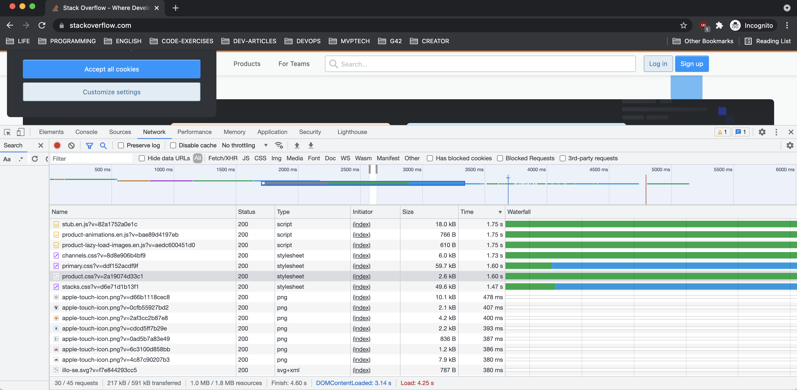

# 3.6. Компьютерные сети, лекция 1

### 1. Работа c HTTP через телнет.

* Подключитесь утилитой телнет к сайту stackoverflow.com telnet stackoverflow.com 80
* отправьте HTTP запрос

```commandline
GET /questions HTTP/1.0
HOST: stackoverflow.com
[press enter]
[press enter]
```

* В ответе укажите полученный HTTP код, что он означает?

```commandline
HTTP/1.1 301 Moved Permanently
cache-control: no-cache, no-store, must-revalidate
location: https://stackoverflow.com/questions
x-request-guid: 9d63ebab-fed1-41de-8231-664194e7166b
feature-policy: microphone 'none'; speaker 'none'
content-security-policy: upgrade-insecure-requests; frame-ancestors 'self' https://stackexchange.com
Accept-Ranges: bytes
Date: Wed, 22 Sep 2021 18:12:00 GMT
Via: 1.1 varnish
Connection: close
X-Served-By: cache-maa10226-MAA
X-Cache: MISS
X-Cache-Hits: 0
X-Timer: S1632334320.270311,VS0,VE237
Vary: Fastly-SSL
X-DNS-Prefetch-Control: off
Set-Cookie: prov=7dbc8f40-865c-fc98-ad6d-9d6545832113; domain=.stackoverflow.com; expires=Fri, 01-Jan-2055 00:00:00 GMT; path=/; HttpOnly

Connection closed by foreign host.
```

**HTTP/1.1 301 Moved Permanently** (с англ. — «Перемещено навсегда»)
HTTP-статус 3 группы(редиректы). 
Данный статус означает что запрошенный ресурс был на постоянной основе перемещён в новое месторасположение.
В данной случае редирект идет на уровне, судя по ответу: Varnish'a(балансировщика нагрузки)
И он ведет на тот же хост, только по протоколу HTTPS: https://stackoverflow.com/questions

### 2. Повторите задание 1 в браузере, используя консоль разработчика F12.

* укажите в ответе полученный HTTP код.

```http request
HTTP/1.1 301 Moved Permanently
cache-control: no-cache, no-store, must-revalidate
location: https://stackoverflow.com/
x-request-guid: 8ab6006d-5c1f-4f8f-b384-bb10b083041c
feature-policy: microphone 'none'; speaker 'none'
content-security-policy: upgrade-insecure-requests; frame-ancestors 'self' https://stackexchange.com
Transfer-Encoding: chunked
Accept-Ranges: bytes
Date: Wed, 22 Sep 2021 18:30:12 GMT
Via: 1.1 varnish
Connection: keep-alive
X-Served-By: cache-qpg1223-QPG
X-Cache: MISS
X-Cache-Hits: 0
X-Timer: S1632335412.230354,VS0,VE234
Vary: Fastly-SSL
X-DNS-Prefetch-Control: off
Set-Cookie: prov=a894e453-5087-395f-f95b-0d3d3cd2581f; domain=.stackoverflow.com; expires=Fri, 01-Jan-2055 00:00:00 GMT; path=/; HttpOnly
```

* проверьте время загрузки страницы, какой запрос обрабатывался дольше всего?

Даже странно, дольше всего обрабатывались запросы статики. 
Я в Дубае живу, видимо, CDN-сервера статики stackoverflow.com находятся далеко от Middle East.

* приложите скриншот консоли браузера в ответ.

**Response Headers Tab:**


**Timings Tab:**



### 3. Какой IP адрес у вас в интернете?

Ответ: **94.204.14.1** 


### 4. Какому провайдеру принадлежит ваш IP адрес? Какой автономной системе AS? Воспользуйтесь утилитой whois

Имя провайдера: **Emirates Integrated Telecommunications Company PJSC (EITC-DU)**

Автономная система: **AS15802**

```commandline
➜  ~ whois -h whois.ripe.net 94.204.14.1
inetnum:        94.204.8.0 - 94.204.15.255
netname:        JV-SouthCircle-EG2-Maple-NET
descr:          Emirates Integrated Telecommunications Company PJSC (EITC-DU)
country:        AE
remarks:        *******************************************************************
remarks:        *  For any kind of illegal activity originating from our network  *
remarks:        *                    Please Contact: abuse@du.ae                  *
remarks:        *******************************************************************
admin-c:        EITC2-RIPE
tech-c:         EITC2-RIPE
status:         ASSIGNED PA
mnt-by:         DIC-MNT
mnt-lower:      DIC-MNT
mnt-routes:     DIC-MNT
created:        2011-10-08T17:16:08Z
last-modified:  2012-03-06T19:09:12Z
source:         RIPE # Filtered

role:           EITC Contact Role
address:        Emirates Integrated Telecommunications
address:        ------
address:        -------
phone:          +971043550323
fax-no:         +971043550323
admin-c:        CC7854-RIPE
tech-c:         CC7854-RIPE
tech-c:         CC7854-RIPE
tech-c:         CC7854-RIPE
nic-hdl:        EITC2-RIPE
abuse-mailbox:  abuse@du.ae
mnt-by:         DIC-MNT
created:        2006-07-25T04:42:43Z
last-modified:  2019-03-11T12:31:11Z
source:         RIPE # Filtered

% Information related to '94.204.0.0/19AS15802'

route:          94.204.0.0/19
descr:          Emirates Integrated Telecommunications Company PJSC
origin:         AS15802
mnt-by:         DIC-MNT
created:        2010-06-03T04:54:30Z
last-modified:  2010-06-03T04:54:30Z
source:         RIPE

% This query was served by the RIPE Database Query Service version 1.101 (BLAARKOP)
```

### 5. Через какие сети проходит пакет, отправленный с вашего компьютера на адрес 8.8.8.8? Через какие AS? Воспользуйтесь утилитой traceroute

```commandline
➜  ~ traceroute -a 8.8.8.8
traceroute to 8.8.8.8 (8.8.8.8), 64 hops max, 52 byte packets
 1  [AS0] 192.168.1.1 (192.168.1.1)  2.743 ms  2.320 ms  2.190 ms
 2  [AS0] 192.168.70.254 (192.168.70.254)  2.173 ms  2.807 ms  2.055 ms
 3  * * *
 4  [AS0] 10.100.136.73 (10.100.136.73)  6.968 ms
    [AS0] 10.142.57.129 (10.142.57.129)  7.022 ms
    [AS0] 10.100.136.73 (10.100.136.73)  24.327 ms
 5  [AS0] 10.100.136.86 (10.100.136.86)  6.731 ms  6.372 ms  9.184 ms
 6  [AS0] 10.17.40.109 (10.17.40.109)  12.297 ms  11.795 ms  11.809 ms
 7  [AS0] 10.17.40.109 (10.17.40.109)  12.727 ms
    [AS0] 10.100.144.9 (10.100.144.9)  11.924 ms  11.233 ms
 8  [AS15802] 94.203.108.51 (94.203.108.51)  8.604 ms  9.148 ms  10.564 ms
 9  [AS0] 10.23.222.190 (10.23.222.190)  11.866 ms
    [AS0] 10.252.55.158 (10.252.55.158)  9.096 ms  8.949 ms
10  [AS15169] dns.google (8.8.8.8)  8.580 ms  16.359 ms  15.192 ms
```

### 6. Повторите задание 5 в утилите mtr. На каком участке наибольшая задержка - delay?

```commandline
➜  sbin sudo mtr -z 8.8.8.8
```

* Ключ **-z** для того чтобы отобразить автономные сети.
* Судя по скриншоту везде +/- одинаковые задержки.
* 3 хост вообще не отдает ответа ICMP, думаю, это тот самый который блокирует весь IPTV-трафик в Эмиратах **xD**


### 7. Какие DNS сервера отвечают за доменное имя dns.google? Какие A записи? Воспользуйтесь утилитой dig

Команда dig для получения сведений об NS-записях:

```commandline
➜  ~ dig +trace dns.google
...
dns.google.		10800	IN	NS	ns3.zdns.google.
dns.google.		10800	IN	NS	ns1.zdns.google.
dns.google.		10800	IN	NS	ns4.zdns.google.
dns.google.		10800	IN	NS	ns2.zdns.google.
...
```

P.S.: часть ответа специально урезал.

Команда dig для получения сведений об A-записях:

```commandline
➜  ~ dig dns.google

; <<>> DiG 9.10.6 <<>> @1.1.1.1 dns.google
; (1 server found)
;; global options: +cmd
;; Got answer:
;; ->>HEADER<<- opcode: QUERY, status: NOERROR, id: 8778
;; flags: qr rd ra ad; QUERY: 1, ANSWER: 2, AUTHORITY: 0, ADDITIONAL: 1

;; OPT PSEUDOSECTION:
; EDNS: version: 0, flags:; udp: 1232
;; QUESTION SECTION:
;dns.google.			IN	A

;; ANSWER SECTION:
dns.google.		628	IN	A	8.8.8.8
dns.google.		628	IN	A	8.8.4.4

;; Query time: 7 msec
;; SERVER: 1.1.1.1#53(1.1.1.1)
;; WHEN: Fri Sep 24 01:32:37 +04 2021
;; MSG SIZE  rcvd: 71
```

Ответ: **8.8.8.8** и **8.8.4.4**

### 8. Проверьте PTR записи для IP адресов из задания 7. Какое доменное имя привязано к IP? Воспользуйтесь утилитой dig

Команда dig для получения сведений о PTR-записях для IP-адреса **8.8.4.4**:

```commandline
➜  ~ dig -x 8.8.4.4

; <<>> DiG 9.10.6 <<>> -x 8.8.4.4
;; global options: +cmd
;; Got answer:
;; ->>HEADER<<- opcode: QUERY, status: NOERROR, id: 6548
;; flags: qr rd ra; QUERY: 1, ANSWER: 1, AUTHORITY: 0, ADDITIONAL: 1

;; OPT PSEUDOSECTION:
; EDNS: version: 0, flags:; udp: 4000
;; QUESTION SECTION:
;4.4.8.8.in-addr.arpa.		IN	PTR

;; ANSWER SECTION:
4.4.8.8.in-addr.arpa.	19561	IN	PTR	dns.google.

;; Query time: 31 msec
;; SERVER: 10.201.10.2#53(10.201.10.2)
;; WHEN: Fri Sep 24 01:38:58 +04 2021
;; MSG SIZE  rcvd: 73
```

Ответ для **8.8.4.4**: *4.4.8.8.in-addr.arpa.*

Ответ для **8.8.4.4**: *8.8.8.8.in-addr.arpa.*
