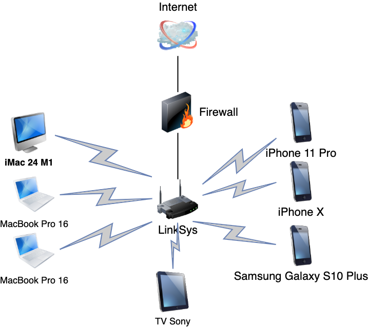

# 3.8. Компьютерные сети, лекция 3

### 1. Подключитесь к публичному маршрутизатору в интернет. Найдите маршрут к вашему публичному IP

```commandline
telnet route-views.routeviews.org
Username: rviews
show ip route x.x.x.x/32
show bgp x.x.x.x/32
```

Ответ:

```commandline
route-views>show ip route 91.73.155.65
Routing entry for 91.73.128.0/19
  Known via "bgp 6447", distance 20, metric 0
  Tag 6939, type external
  Last update from 64.71.137.241 7w0d ago
  Routing Descriptor Blocks:
  * 64.71.137.241, from 64.71.137.241, 7w0d ago
      Route metric is 0, traffic share count is 1
      AS Hops 2
      Route tag 6939
      MPLS label: none
```

```commandline
route-views>show ip route 91.73.155.65
Routing entry for 91.73.128.0/19
  Known via "bgp 6447", distance 20, metric 0
  Tag 6939, type external
  Last update from 64.71.137.241 7w0d ago
  Routing Descriptor Blocks:
  * 64.71.137.241, from 64.71.137.241, 7w0d ago
      Route metric is 0, traffic share count is 1
      AS Hops 2
      Route tag 6939
      MPLS label: none
route-views>show bgp 91.73.155.65
BGP routing table entry for 91.73.128.0/19, version 970920162
Paths: (24 available, best #23, table default)
...
...
... etc.
```

### 2. Создайте dummy0 интерфейс в Ubuntu. Добавьте несколько статических маршрутов. Проверьте таблицу маршрутизации.

```commandline
root@vagrant:/home/vagrant# echo "dummy" >> /etc/modules
root@vagrant:/home/vagrant# echo "options dummy numdummies=2" > /etc/modprobe.d/dummy.conf
root@vagrant:/home/vagrant# vim /etc/network/interfaces
```

Добавляем в interfaces описание:

```text
auto dummy0
iface dummy0 inet static
    address 10.2.2.2/32
    pre-up ip link add dummy0 type dummy
    post-down ip link del dummy0
```

Перезагружаем интерфейс:

```commandline
root@vagrant:/home/vagrant# systemctl restart networking
```

Проверяем список интерфейсов:

```
root@vagrant:/home/vagrant# ifconfig
dummy0: flags=195<UP,BROADCAST,RUNNING,NOARP>  mtu 1500
        inet 10.2.2.2  netmask 255.255.255.255  broadcast 10.2.2.2
        inet6 fe80::a807:5ff:fe7c:e08f  prefixlen 64  scopeid 0x20<link>
        ether aa:07:05:7c:e0:8f  txqueuelen 1000  (Ethernet)
        RX packets 0  bytes 0 (0.0 B)
        RX errors 0  dropped 0  overruns 0  frame 0
        TX packets 6  bytes 420 (420.0 B)
        TX errors 0  dropped 0 overruns 0  carrier 0  collisions 0
```

Проверяем таблицу маршрутизации:

```commandline
root@vagrant:/home/vagrant# ip -br r
default via 10.0.2.2 dev eth0 proto dhcp src 10.0.2.15 metric 100
10.0.2.0/24 dev eth0 proto kernel scope link src 10.0.2.15
10.0.2.2 dev eth0 proto dhcp scope link src 10.0.2.15 metric 100
```

### 3. Проверьте открытые TCP порты в Ubuntu, какие протоколы и приложения используют эти порты? Приведите несколько примеров.

Можно так проверить открытые TCP:

```commandline
ubuntu@ip-172-31-12-151:~$ sudo lsof -i -P -n | grep LISTEN
systemd-r   388 systemd-resolve   13u  IPv4  19632      0t0  TCP 127.0.0.53:53 (LISTEN)
sshd        665            root    3u  IPv4  23587      0t0  TCP *:22 (LISTEN)
sshd        665            root    4u  IPv6  23598      0t0  TCP *:22 (LISTEN)
apache2   34346            root    4u  IPv6 193062      0t0  TCP *:80 (LISTEN)
apache2   34346            root    6u  IPv6 193066      0t0  TCP *:443 (LISTEN)
apache2   83737        www-data    4u  IPv6 193062      0t0  TCP *:80 (LISTEN)
apache2   83737        www-data    6u  IPv6 193066      0t0  TCP *:443 (LISTEN)
apache2   83738        www-data    4u  IPv6 193062      0t0  TCP *:80 (LISTEN)
apache2   83738        www-data    6u  IPv6 193066      0t0  TCP *:443 (LISTEN)
```

Еще так:

```commandline
ubuntu@ip-172-31-12-151:~$ sudo netstat -tulpn | grep LISTEN
tcp        0      0 127.0.0.53:53           0.0.0.0:*               LISTEN      388/systemd-resolve
tcp        0      0 0.0.0.0:22              0.0.0.0:*               LISTEN      665/sshd: /usr/sbin
tcp6       0      0 :::22                   :::*                    LISTEN      665/sshd: /usr/sbin
tcp6       0      0 :::443                  :::*                    LISTEN      34346/apache2
tcp6       0      0 :::80                   :::*                    LISTEN      34346/apache2
```

И так:

```commandline
ubuntu@ip-172-31-12-151:~$ sudo ss -tulpn | grep LISTEN
tcp    LISTEN  0       4096           127.0.0.53%lo:53            0.0.0.0:*      users:(("systemd-resolve",pid=388,fd=13))
tcp    LISTEN  0       128                  0.0.0.0:22            0.0.0.0:*      users:(("sshd",pid=665,fd=3))
tcp    LISTEN  0       128                     [::]:22               [::]:*      users:(("sshd",pid=665,fd=4))
tcp    LISTEN  0       511                        *:443                 *:*      users:(("apache2",pid=83738,fd=6),("apache2",pid=83737,fd=6),("apache2",pid=34346,fd=6))
tcp    LISTEN  0       511                        *:80                  *:*      users:(("apache2",pid=83738,fd=4),("apache2",pid=83737,fd=4),("apache2",pid=34346,fd=4))
```

### 4. Проверьте используемые UDP сокеты в Ubuntu, какие протоколы и приложения используют эти порты?

```commandline
ubuntu@ip-172-31-12-151:~$ ss -ua
State        Recv-Q       Send-Q                  Local Address:Port                 Peer Address:Port       Process
UNCONN       0            0                       127.0.0.53%lo:domain                    0.0.0.0:*
UNCONN       0            0                  172.31.12.151%eth0:bootpc                    0.0.0.0:*
```

### 5. Используя diagrams.net, создайте L3 диаграмму вашей домашней сети или любой другой сети, с которой вы работали.


