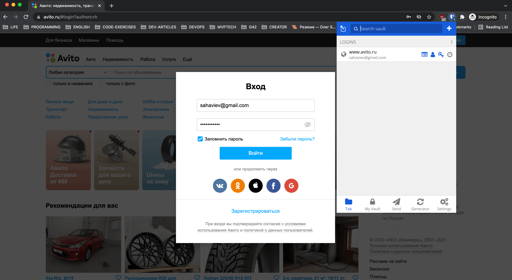
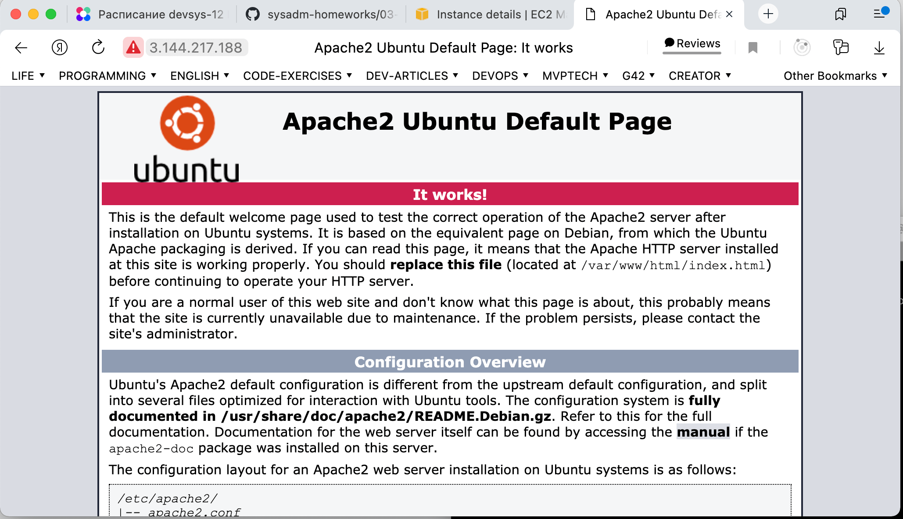
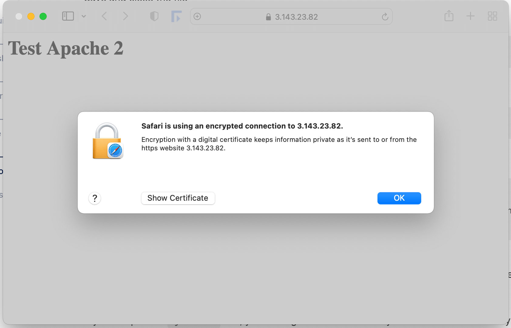

# 3.9. Элементы безопасности информационных систем

### 1. Установите Bitwarden плагин для браузера. Зарегистрируйтесь и сохраните несколько паролей.

Интересная программка, работает хорошо, в некоторых моментах даже лучше стандартного
инструмента сохранения паролей от Google Chrome.



### 2. Установите Google authenticator на мобильный телефон. Настройте вход в Bitwarden акаунт через Google authenticator OTP.

Не знаю каким образом можно показать что я это сделал. Но вот скриншот с личного кабинета.


### 3. Установите apache2, сгенерируйте самоподписанный сертификат, настройте тестовый сайт для работы по HTTPS.

Установка apache2:

```commandline
ubuntu@ip-172-31-17-168:~$ sudo apt update
...
ubuntu@ip-172-31-17-168:~$ sudo apt install apache2
...
ubuntu@ip-172-31-17-168:~$ sudo ufw app list
  Apache
  Apache Full
  Apache Secure
  OpenSSH
ubuntu@ip-172-31-17-168:~$ sudo ufw allow 'Apache'
Rules updated
Rules updated (v6)
ubuntu@ip-172-31-17-168:~$ sudo ufw status
Status: inactive
ubuntu@ip-172-31-17-168:~$ systemctl status apache2
● apache2.service - The Apache HTTP Server
     Loaded: loaded (/lib/systemd/system/apache2.service; enabled; vendor pr>
     Active: active (running) since Tue 2021-11-16 19:57:47 UTC; 1min 53s ago
       Docs: https://httpd.apache.org/docs/2.4/
   Main PID: 45125 (apache2)
      Tasks: 55 (limit: 1160)
     Memory: 5.5M
     CGroup: /system.slice/apache2.service
             ├─45125 /usr/sbin/apache2 -k start
             ├─45127 /usr/sbin/apache2 -k start
             └─45128 /usr/sbin/apache2 -k start
```



Создание сертификата:

```commandline
root@ip-172-31-12-151:~# sudo openssl req -x509 -nodes -days 365 -newkey rsa:2048 -keyout /etc/ssl/private/apache-self-signed.key -out /etc/ssl/certs/apache-self-signed.crt
Generating a RSA private key
............+++++
......................................................+++++
writing new private key to '/etc/ssl/private/apache-self-signed.key'
-----
You are about to be asked to enter information that will be incorporated
into your certificate request.
What you are about to enter is what is called a Distinguished Name or a DN.
There are quite a few fields but you can leave some blank
For some fields there will be a default value,
If you enter '.', the field will be left blank.
-----
Country Name (2 letter code) [AU]:AE
State or Province Name (full name) [Some-State]:Dubai
Locality Name (eg, city) []:Dubai
Organization Name (eg, company) [Internet Widgits Pty Ltd]:Rail Sakhaviev Ltd.
Organizational Unit Name (eg, section) []:IT
Common Name (e.g. server FQDN or YOUR name) []:ec2-3-143-23-82.us-east-2.compute.amazonaws.com
Email Address []:sahaviev@gmail.com
```

Конфигурация apache: 

```commandline
sudo nano /etc/apache2/sites-available/test.conf
```

```text
<VirtualHost *:443>
   ServerName ec2-3-143-23-82.us-east-2.compute.amazonaws.com
   DocumentRoot /var/www/html-2

   SSLEngine on
   SSLCertificateFile /etc/ssl/certs/apache-self-signed.crt
   SSLCertificateKeyFile /etc/ssl/private/apache-self-signed.key
</VirtualHost>
```

```commandline
ubuntu@ip-172-31-12-151:/var/www$ sudo a2ensite test.conf
Enabling site test.
To activate the new configuration, you need to run:
  systemctl reload apache2
ubuntu@ip-172-31-12-151:/var/www$ sudo a2enmod ssl
Considering dependency setenvif for ssl:
Module setenvif already enabled
Considering dependency mime for ssl:
Module mime already enabled
Considering dependency socache_shmcb for ssl:
Module socache_shmcb already enabled
Module ssl already enabled
ubuntu@ip-172-31-12-151:/var/www$ sudo systemctl restart apache2
```




P.S.: К сожалению проделанные действия включая указание домена в Common Name и 
ServerName директивы в Apache не поменяли ничего в браузерах типа GoogleChrome
или Yandex.Browser. Они по-прежнему не хотят пропускать этот сайт.


### 4. Проверьте на TLS уязвимости произвольный сайт в интернете.

Просканировал один из сайтов, который я когда-то делал. 
Вывод testssl.sh огромный, я сохранил его [testssl.sh https://goyes.ru/](assets/testssl.txt).

Результат дал оценку M. Из-за того что сертификат не соответствует доменному имени.

```commandline
➜  testssl.sh git:(3.1dev) ./testssl.sh https://goyes.ru/
Overall Grade                M
 Grade cap reasons            Grade capped to M. Domain name mismatch
```

### 5. Установите на Ubuntu ssh сервер, сгенерируйте новый приватный ключ. Скопируйте свой публичный ключ на другой сервер. Подключитесь к серверу по SSH-ключу.

Вот так можно сгенерировать ключи:

```commandline
ubuntu@ip-172-31-12-151:~/.ssh$ ls
authorized_keys
ubuntu@ip-172-31-12-151:~/.ssh$ ssh-keygen -t rsa -b 4096 -C "sahaviev@gmail.com"
Generating public/private rsa key pair.
Enter file in which to save the key (/home/ubuntu/.ssh/id_rsa):
Enter passphrase (empty for no passphrase):
Enter same passphrase again:
Your identification has been saved in /home/ubuntu/.ssh/id_rsa
Your public key has been saved in /home/ubuntu/.ssh/id_rsa.pub
The key fingerprint is:
SHA256:4n3SMD64OCMYt0XEUFd2KFogKVn86Q+fwXmvLYcvr7E sahaviev@gmail.com
The key's randomart image is:
+---[RSA 4096]----+
| ++=o...o..      |
|o o.o.o...       |
| . o + .         |
|    =            |
|   o ...S        |
|. . +.+=.+       |
| + o +o+*oo      |
|. o o.+.+Bo      |
|   ..o. EO+      |
+----[SHA256]-----+
```

Сохраняем pub-ключ ну нужно сервисе или другом сервере и можем подключаться куда нужно без ввода пароля.

### 6. Переименуйте файлы ключей из задания 5. Настройте файл конфигурации SSH клиента, так чтобы вход на удаленный сервер осуществлялся по имени сервера.

Ниже пример как я сделал эту настройку для своей Ubuntu на AWS: 

```commandline
➜  .ssh nano config
Host *
  AddKeysToAgent yes
  UseKeychain yes
  IdentityFile ~/.ssh/id_ed25519

Host ubuntu@ec2-3-143-23-82.us-east-2.compute.amazonaws.com
  IdentityFile ~/.ssh/key-pair-amazon-freetier-ubuntu.pem
```

### 7. Соберите дамп трафика утилитой tcpdump в формате pcap, 100 пакетов. Откройте файл pcap в Wireshark.

```commandline
ubuntu@ip-172-31-12-151:~$ sudo su
root@ip-172-31-12-151:/home/ubuntu# tcpdump -c 100 -w dump.pcap
tcpdump: listening on eth0, link-type EN10MB (Ethernet), capture size 262144 bytes
```


## Дополнительное задание (со звездочкой*) - необязательно к выполнению

### 8. Просканируйте хост scanme.nmap.org. Какие сервисы запущены?

```commandline
ubuntu@ip-172-31-12-151:~$ sudo nmap -O scan.nmap.org
Starting Nmap 7.80 ( https://nmap.org ) at 2021-11-20 12:02 UTC
Nmap scan report for scan.nmap.org (45.33.49.119)
Host is up (0.072s latency).
Other addresses for scan.nmap.org (not scanned): 2600:3c01:e000:3e6::6d4e:7061
rDNS record for 45.33.49.119: ack.nmap.org
Not shown: 994 filtered ports
PORT      STATE  SERVICE
22/tcp    open   ssh
70/tcp    closed gopher
80/tcp    open   http
113/tcp   closed ident
443/tcp   open   https
31337/tcp closed Elite
Device type: general purpose|storage-misc|firewall
Running (JUST GUESSING): Linux 2.6.X|4.X|3.X (94%), Synology DiskStation Manager 5.X (87%), WatchGuard Fireware 11.X (86%), FreeBSD 6.X (85%)
OS CPE: cpe:/o:linux:linux_kernel:2.6.32 cpe:/o:linux:linux_kernel:4.4 cpe:/o:linux:linux_kernel:3.10 cpe:/o:linux:linux_kernel cpe:/a:synology:diskstation_manager:5.1 cpe:/o:watchguard:fireware:11.8 cpe:/o:freebsd:freebsd:6.2
Aggressive OS guesses: Linux 2.6.32 (94%), Linux 4.4 (94%), Linux 2.6.32 or 3.10 (92%), Linux 2.6.32 - 2.6.35 (91%), Linux 4.0 (91%), Linux 2.6.32 - 2.6.39 (91%), Linux 3.11 - 4.1 (89%), Linux 3.2 - 3.8 (89%), Linux 2.6.18 (88%), Linux 2.6.32 - 3.0 (88%)
No exact OS matches for host (test conditions non-ideal).

OS detection performed. Please report any incorrect results at https://nmap.org/submit/ .
Nmap done: 1 IP address (1 host up) scanned in 9.94 seconds
```

Сервисы запущены: SSH, gopher, http, https, ident, Elite.

Открыты порты: SSH, http, https. 


### 9. Установите и настройте фаервол ufw на web-сервер из задания 3. Откройте доступ снаружи только к портам 22,80,443