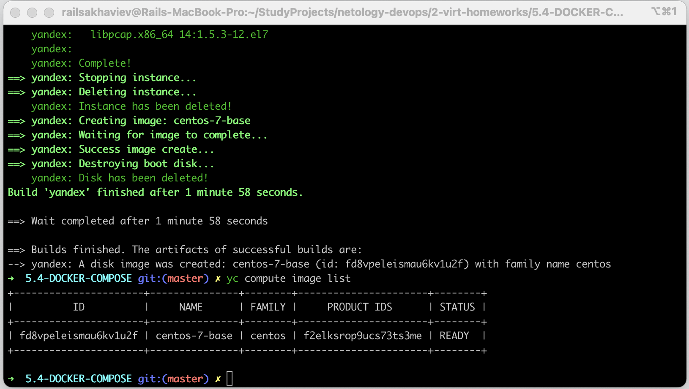
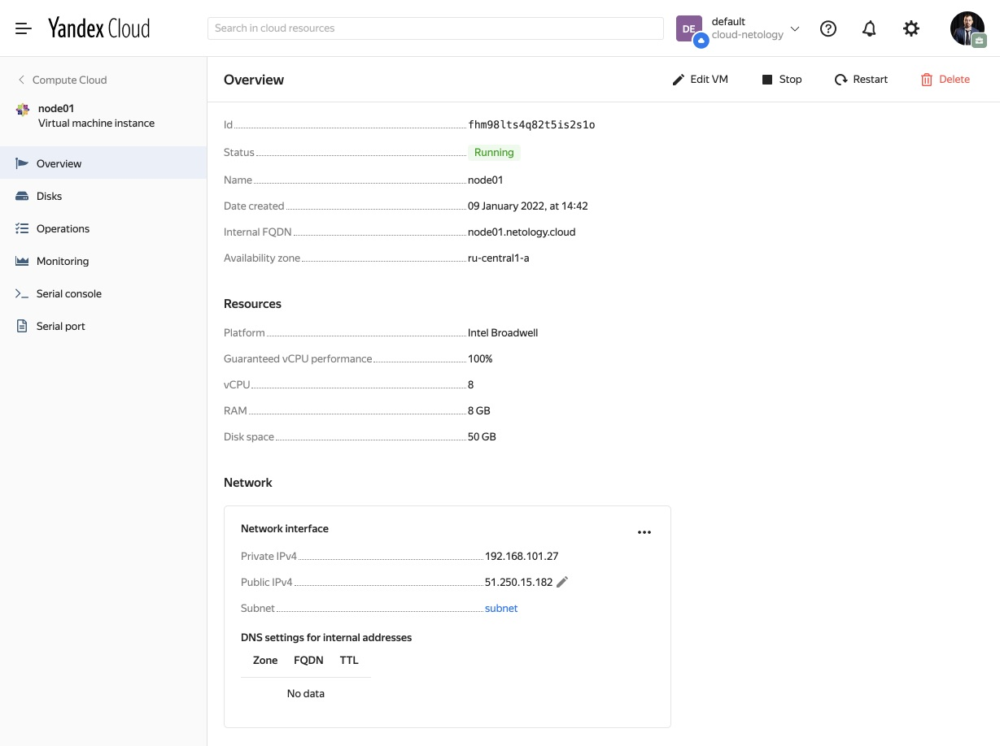

# 5.4. Оркестрация группой Docker контейнеров на примере Docker Compose

## Задача 1

Создать собственный образ операционной системы с помощью Packer.

Для получения зачета, вам необходимо предоставить:
- Скриншот страницы, как на слайде из презентации (слайд 37).

---

**Ответ**:

Инициализация Yandex.Cloud

```commandline
➜  5.4-DOCKER-COMPOSE git:(master) ✗ yc init
Welcome! This command will take you through the configuration process.
Pick desired action:
 [1] Re-initialize this profile 'default' with new settings
 [2] Create a new profile
Please enter your numeric choice: 1
Please go to https://oauth.yandex.ru/authorize?response_type=token&client_id=_____client_id_____ in order to obtain OAuth token.

Please enter OAuth token: [b1g40**********je92n] _____token_____
You have one cloud available: 'cloud-netology' (id = _____cloud-id_____). It is going to be used by default.
Please choose folder to use:
 [1] default (id = _____cloud-id_____)
 [2] Create a new folder
Please enter your numeric choice: 1
Your current folder has been set to 'default' (id = _____folder-id_____).
Do you want to configure a default Compute zone? [Y/n] Y
Which zone do you want to use as a profile default?
 [1] ru-central1-a
 [2] ru-central1-b
 [3] ru-central1-c
 [4] Don't set default zone
Please enter your numeric choice: 1
Your profile default Compute zone has been set to 'ru-central1-a'.
```

Конфигурация Yandex.Cloud

```commandline
➜  5.4-DOCKER-COMPOSE git:(master) ✗ yc config list
token: _____token_____
cloud-id: _____cloud-id_____
folder-id: _____folder-id_____
compute-default-zone: ru-central1-a
```

Создание сети в Yandex.Cloud

```commandline
➜  5.4-DOCKER-COMPOSE git:(master) ✗ yc vpc network create \
 --name net \
 --labels my-label=netology \
 --description "netology-network"

id: _____network-id______
folder_id: _____folder-id_____
created_at: "2022-01-07T12:11:00Z"
name: net
description: my first network via yc
labels:
  my-label: netology
```

Создание подсети в Yandex.Cloud

```commandline
➜  5.4-DOCKER-COMPOSE git:(master) ✗ yc vpc subnet create \
 --name my-subnet-a \
 --zone ru-central1-a \
 --range 10.1.2.0/24 \
 --network-name net \
 --description "netology-subnet"

id: _____subnet-id_____
folder_id: _____folder-id_____
created_at: "2022-01-07T12:13:29Z"
name: my-subnet-a
description: my first subnet via yc
network_id: enp7badt4kg8b1nonbdm
zone_id: ru-central1-a
v4_cidr_blocks:
- 10.1.2.0/24
```

Копируем **packer/centos-7-base.template.json** в **packer/centos-7-base.json** и заменяем в нем:
1. ____token____
2. ____subnet-id____
3. ____folder-id____

Проверяем конфигурационный файл packer'a:

```commandline
➜  5.4-DOCKER-COMPOSE git:(master) ✗ packer validate packer/centos-7-base.json
The configuration is valid.
```

Запускаем packer и создаем образ виртуальной машины в Yandex.Cloud:

```commandline
➜  5.4-DOCKER-COMPOSE git:(master) ✗ packer build packer/centos-7-base.json
yandex: output will be in this color.

==> yandex: Creating temporary ssh key for instance...
...
...
...
==> yandex: Creating image: centos-7-base
==> yandex: Waiting for image to complete...
==> yandex: Success image create...
==> yandex: Destroying boot disk...
    yandex: Disk has been deleted!
Build 'yandex' finished after 1 minute 58 seconds.

==> Wait completed after 1 minute 58 seconds

==> Builds finished. The artifacts of successful builds are:
--> yandex: A disk image was created: centos-7-base (id: fd8vpeleismau6kv1u2f) with family name centos
➜  5.4-DOCKER-COMPOSE git:(master) ✗ yc compute image list
+----------------------+---------------+--------+----------------------+--------+
|          ID          |     NAME      | FAMILY |     PRODUCT IDS      | STATUS |
+----------------------+---------------+--------+----------------------+--------+
| fd8vpeleismau6kv1u2f | centos-7-base | centos | f2elksrop9ucs73ts3me | READY  |
+----------------------+---------------+--------+----------------------+--------+
```

Удаляем подсеть и сеть которые были использованы для создания виртуальной машины:

```commandline
➜  terraform git:(master) ✗ yc vpc subnet delete --name my-subnet-a
done (2s)
➜  terraform git:(master) ✗ yc vpc network delete --name net
```




## Задача 2

Создать вашу первую виртуальную машину в Яндекс.Облаке.

Для получения зачета, вам необходимо предоставить:
- Скриншот страницы свойств созданной ВМ

---

**Ответ**:

Создаем сервисный аккаунт с ролью admin в облаке по адресу https://console.cloud.yandex.ru/folders/___foder-id___?section=service-accounts
____folder-id____ заменить на свой

Создаем файл с ключами:

```commandline
➜  terraform git:(master) ✗ yc iam key create --service-account-name netology-service-account --output key.json
```

Копируем **terraform/variables.template.tf** в **terraform/variables.tf** и заменяем в нем:
1. ____cloud-id____
2. ____folder-id____
3. ____vm-id____

Инициализируем Terraform - **terraform init**:

```commandline
➜  5.4-DOCKER-COMPOSE git:(master) ✗ terraform --version
Terraform v1.1.3
on darwin_arm64
➜  5.4-DOCKER-COMPOSE git:(master) ✗ cd terraform
➜  terraform git:(master) ✗ terraform init

Initializing the backend...

Initializing provider plugins...
- Finding latest version of yandex-cloud/yandex...
- Installing yandex-cloud/yandex v0.69.0...
- Installed yandex-cloud/yandex v0.69.0 (self-signed, key ID E40F590B50BB8E40)

Partner and community providers are signed by their developers.
If you'd like to know more about provider signing, you can read about it here:
https://www.terraform.io/docs/cli/plugins/signing.html

Terraform has created a lock file .terraform.lock.hcl to record the provider
selections it made above. Include this file in your version control repository
so that Terraform can guarantee to make the same selections by default when
you run "terraform init" in the future.

Terraform has been successfully initialized!

You may now begin working with Terraform. Try running "terraform plan" to see
any changes that are required for your infrastructure. All Terraform commands
should now work.

If you ever set or change modules or backend configuration for Terraform,
rerun this command to reinitialize your working directory. If you forget, other
commands will detect it and remind you to do so if necessary.
```

Выполняем **terraform validate**:

```commandline
➜  terraform git:(master) ✗ terraform validate
Success! The configuration is valid.
```

Выполняем **terraform plan**:

```commandline
➜  terraform git:(master) ✗ terraform plan
Terraform used the selected providers to generate the following execution plan. Resource actions are
indicated with the following symbols:
  + create
... 
... // too much output
...
```

Выполняем **terraform apply**:

```commandline
➜  terraform git:(master) ✗ terraform apply --auto-approve
Terraform used the selected providers to generate the following execution plan. Resource actions are
indicated with the following symbols:
  + create
...
... // too much output
... 
Apply complete! Resources: 3 added, 0 changed, 0 destroyed.

Outputs:

external_ip_address_node01_yandex_cloud = "51.250.15.182"
internal_ip_address_node01_yandex_cloud = "192.168.101.27"
```




## Задача 3

Создать ваш первый готовый к боевой эксплуатации компонент мониторинга, состоящий из стека микросервисов.

Для получения зачета, вам необходимо предоставить:
- Скриншот работающего веб-интерфейса Grafana с текущими метриками

---

**Ответ**:

Добавляем в **ansible/inventory** файл ip-адрес хоста в Yandex.Cloud.

Запускаем ansible-playbook:

```commandline
➜  5.4-DOCKER-COMPOSE git:(master) ✗ cd ansible
➜  ansible git:(master) ✗ ansible-playbook provision.yml

PLAY [nodes] ************************************************************************************************

TASK [Gathering Facts] **************************************************************************************
ok: [node01.netology.cloud]

TASK [Create directory for ssh-keys] ************************************************************************
ok: [node01.netology.cloud]

TASK [Adding rsa-key in /root/.ssh/authorized_keys] *********************************************************
ok: [node01.netology.cloud]

TASK [Checking DNS] *****************************************************************************************
changed: [node01.netology.cloud]

TASK [Installing tools] *************************************************************************************
changed: [node01.netology.cloud] => (item=git)
ok: [node01.netology.cloud] => (item=curl)

TASK [Add docker repository] ********************************************************************************
changed: [node01.netology.cloud]

TASK [Installing docker package] ****************************************************************************
changed: [node01.netology.cloud] => (item=docker-ce)
ok: [node01.netology.cloud] => (item=docker-ce-cli)
ok: [node01.netology.cloud] => (item=containerd.io)

TASK [Enable docker daemon] *********************************************************************************
changed: [node01.netology.cloud]

TASK [Install docker-compose] *******************************************************************************
changed: [node01.netology.cloud]

TASK [Synchronization] **************************************************************************************
changed: [node01.netology.cloud]

TASK [Pull all images in compose] ***************************************************************************
changed: [node01.netology.cloud]

TASK [Up all services in compose] ***************************************************************************
changed: [node01.netology.cloud]

PLAY RECAP **************************************************************************************************
node01.netology.cloud      : ok=12   changed=9    unreachable=0    failed=0    skipped=0    rescued=0    ignored=0
```


## Задача 4 (*)

Создать вторую ВМ и подключить её к мониторингу развёрнутому на первом сервере.

Для получения зачета, вам необходимо предоставить:
- Скриншот из Grafana, на котором будут отображаться метрики добавленного вами сервера.


## Удаление созданных виртуальных машин

Выполняем **terraform destroy**:

```commandline
➜  terraform git:(master) ✗ terraform destroy --auto-approve
```

```commandline
➜  terraform git:(master) ✗ terraform destroy --auto-approve
yandex_vpc_network.default: Refreshing state... [id=enpde7nje4e2r6j8gchh]
yandex_vpc_subnet.default: Refreshing state... [id=e9bnrfsb0i6jde9nm540]
yandex_compute_instance.node02: Refreshing state... [id=fhm6jin7j9ethv73cc7e]
yandex_compute_instance.node01: Refreshing state... [id=fhmg34vbn840h6gu77e3]

Terraform used the selected providers to generate the following execution plan. Resource actions are indicated with the following symbols:
  - destroy
...
... // too much output
... 
yandex_vpc_network.default: Destroying... [id=enpde7nje4e2r6j8gchh]
yandex_vpc_network.default: Destruction complete after 1s

Destroy complete! Resources: 4 destroyed.
➜  terraform git:(master) ✗ 
```