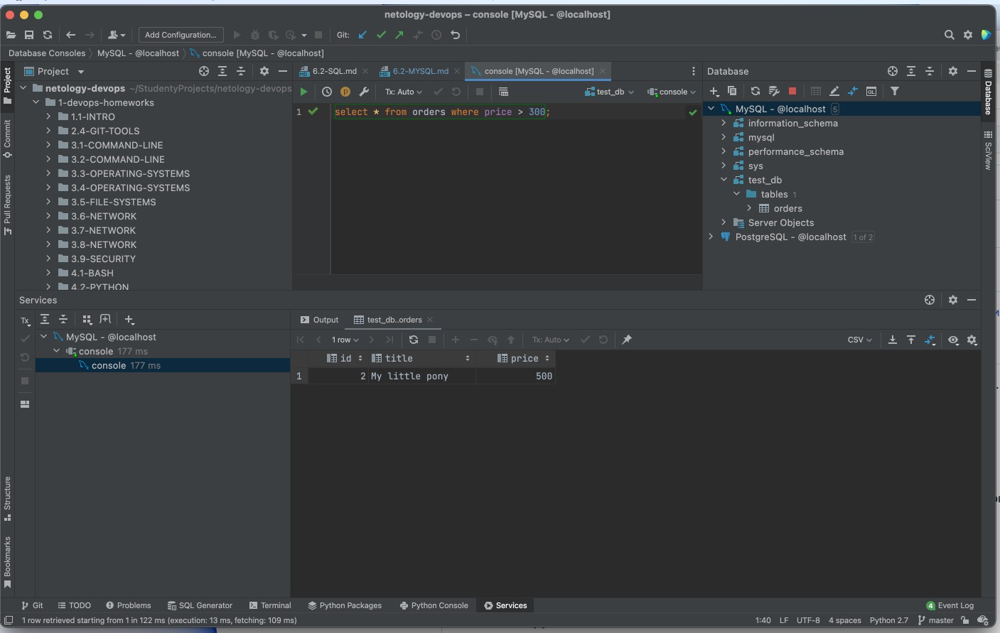

# 6.3. MySQL

## Задача 1

Используя docker поднимите инстанс MySQL (версию 8). Данные БД сохраните в volume.

Изучите [бэкап БД](test_data.sql) и 
восстановитесь из него.

Перейдите в управляющую консоль `mysql` внутри контейнера.

Используя команду `\h` получите список управляющих команд.

Найдите команду для выдачи статуса БД и **приведите в ответе** из ее вывода версию сервера БД.

Подключитесь к восстановленной БД и получите список таблиц из этой БД.

**Приведите в ответе** количество записей с `price` > 300.

В следующих заданиях мы будем продолжать работу с данным контейнером.

**Ответ**:

1. Run docker compose

```commandline
railsakhaviev@Rails-iMac 2-virt-homeworks % docker-compose up -d
```

2. Check docker containers list

```commandline
railsakhaviev@Rails-iMac 2-virt-homeworks % docker ps
CONTAINER ID   IMAGE     COMMAND                  CREATED      STATUS      PORTS                               NAMES
760b84860a7f   mysql:8   "docker-entrypoint.s…"   2 days ago   Up 2 days   0.0.0.0:3306->3306/tcp, 33060/tcp   mysql8
```

3. Connect to docker

```commandline
railsakhaviev@Rails-iMac 2-virt-homeworks % docker exec -ti 760b84860a7f /bin/bash
```

4. Connect to mysql server (root password: "root")
```
mysql -u root -p
```

5. Run status command

```commandline
mysql> \s
--------------
/usr/bin/mysql  Ver 8.0.27 for Linux on x86_64 (MySQL Community Server - GPL)

Connection id:          20
Current database:       
Current user:           root@127.0.0.1
SSL:                    Cipher in use is TLS_AES_256_GCM_SHA384
Current pager:          stdout
Using outfile:          ''
Using delimiter:        ;
Server version:         8.0.27 MySQL Community Server - GPL
Protocol version:       10
Connection:             127.0.0.1 via TCP/IP
Server characterset:    utf8mb4
Db     characterset:    utf8mb4
Client characterset:    latin1
Conn.  characterset:    latin1
TCP port:               3306
Binary data as:         Hexadecimal
Uptime:                 3 hours 10 min 3 sec

Threads: 3  Questions: 4884  Slow queries: 0  Opens: 435  Flush tables: 3  Open tables: 353  Queries per second avg: 0.428
--------------
```



## Задача 2

Создайте пользователя test в БД c паролем test-pass, используя:
- плагин авторизации mysql_native_password
- срок истечения пароля - 180 дней 
- количество попыток авторизации - 3 
- максимальное количество запросов в час - 100
- аттрибуты пользователя:
    - Фамилия "Pretty"
    - Имя "James"

Предоставьте привилегии пользователю `test` на операции SELECT базы `test_db`.
    
Используя таблицу INFORMATION_SCHEMA.USER_ATTRIBUTES получите данные по пользователю `test` и 
**приведите в ответе к задаче**.

**Ответ**:

```sql
CREATE USER 'test'@'localhost'
    IDENTIFIED WITH caching_sha2_password BY 'test-pass'
    REQUIRE NONE
 WITH MAX_QUERIES_PER_HOUR 100
PASSWORD EXPIRE INTERVAL 180 DAY FAILED_LOGIN_ATTEMPTS 3 PASSWORD_LOCK_TIME 2
ATTRIBUTE '{"fname": "Pretty", "lname": "James"}';

GRANT SELECT ON test_db.* TO 'test'@'localhost';

SELECT * FROM INFORMATION_SCHEMA.USER_ATTRIBUTES WHERE USER = "test";
-- Result: test,localhost,"{""fname"": ""Pretty"", ""lname"": ""James""}"
```


## Задача 3

Установите профилирование `SET profiling = 1`.
Изучите вывод профилирования команд `SHOW PROFILES;`.

Исследуйте, какой `engine` используется в таблице БД `test_db` и **приведите в ответе**.

Измените `engine` и **приведите время выполнения и запрос на изменения из профайлера в ответе**:
- на `MyISAM`
- на `InnoDB`

**Ответ**: Изначально делал все через GUI от PyCharm, а она подключается и делает кучу своих запросов и вывод профайлера
получался очень грязный. Потом понял что это лучше делать через прямое подключение к **mysql** в терминале.

```sql
mysql> use test_db;
Reading table information for completion of table and column names
You can turn off this feature to get a quicker startup with -A

Database changed
mysql> show tables
    -> ;
+-------------------+
| Tables_in_test_db |
+-------------------+
| orders            |
+-------------------+
1 row in set (0.02 sec)

mysql> SELECT TABLE_NAME,
    ->        ENGINE
    -> FROM   information_schema.TABLES
    -> WHERE  TABLE_SCHEMA = 'test_db';
+------------+--------+
| TABLE_NAME | ENGINE |
+------------+--------+
| orders     | MyISAM |
+------------+--------+
1 row in set (0.02 sec)

mysql> SET profiling = 1;
Query OK, 0 rows affected, 1 warning (0.00 sec)

mysql> ALTER TABLE orders ENGINE = InnoDB;
Query OK, 5 rows affected (0.09 sec)
Records: 5  Duplicates: 0  Warnings: 0

mysql> SHOW PROFILES;
+----------+------------+------------------------------------+
| Query_ID | Duration   | Query                              |
+----------+------------+------------------------------------+
|        1 | 0.08190550 | ALTER TABLE orders ENGINE = InnoDB |
+----------+------------+------------------------------------+
1 row in set, 1 warning (0.00 sec)

mysql> SHOW PROFILE FOR QUERY 1;
+--------------------------------+----------+
| Status                         | Duration |
+--------------------------------+----------+
| starting                       | 0.001103 |
| Executing hook on transaction  | 0.000068 |
| starting                       | 0.000186 |
| checking permissions           | 0.000057 |
| checking permissions           | 0.000153 |
| init                           | 0.000115 |
| Opening tables                 | 0.002759 |
| setup                          | 0.000692 |
| creating table                 | 0.001006 |
| After create                   | 0.033379 |
| System lock                    | 0.000092 |
| copy to tmp table              | 0.000601 |
| rename result table            | 0.006570 |
| waiting for handler commit     | 0.000061 |
| waiting for handler commit     | 0.007488 |
| waiting for handler commit     | 0.000048 |
| waiting for handler commit     | 0.017683 |
| waiting for handler commit     | 0.000040 |
| waiting for handler commit     | 0.005571 |
| waiting for handler commit     | 0.000024 |
| waiting for handler commit     | 0.001123 |
| end                            | 0.001951 |
| query end                      | 0.000949 |
| closing tables                 | 0.000017 |
| waiting for handler commit     | 0.000066 |
| freeing items                  | 0.000056 |
| cleaning up                    | 0.000051 |
+--------------------------------+----------+
27 rows in set, 1 warning (0.00 sec)
```

## Задача 4 

Изучите файл `my.cnf` в директории /etc/mysql.

Измените его согласно ТЗ (движок InnoDB):
- Скорость IO важнее сохранности данных
- Нужна компрессия таблиц для экономии места на диске
- Размер буффера с незакомиченными транзакциями 1 Мб
- Буффер кеширования 30% от ОЗУ
- Размер файла логов операций 100 Мб

Приведите в ответе измененный файл `my.cnf`.

**Ответ**:

В docker-compose подключаю volume который заменяет **/etc/mysql/conf.d** где как я понял согласно **my.cnf**
должны лежать конфиги для его переопределения или расширения.

```text
[mysqld]

innodb_flush_log_at_trx_commit = 2
innodb_buffer_pool_size = 582M
innodb_log_buffer_size = 1M
innodb_log_file_size = 100M

[mysql]
```

Единственную переменную, которую я не нашел "Нужна компрессия таблиц для экономии места на диске"?

На лекции о ней не рассказывали, что это за компрессия? 

> P.S.: innodb_file_format=Barracuda уже не поддерживается если что в 8 версии MySQL. 
> Установка этой переменной крашит запуск демона 