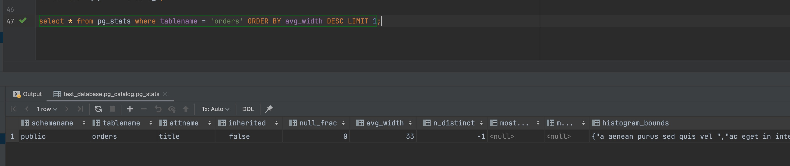
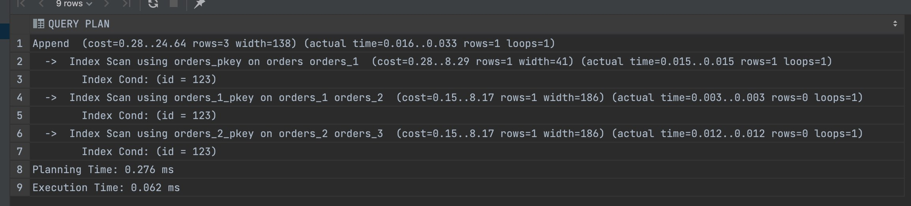
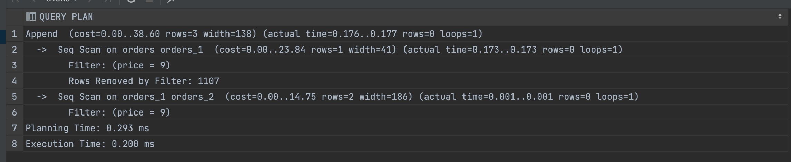

# 6.4. PostgreSQL

## Задача 1

Используя docker поднимите инстанс PostgreSQL (версию 13). Данные БД сохраните в volume.

Подключитесь к БД PostgreSQL используя `psql`.

Воспользуйтесь командой `\?` для вывода подсказки по имеющимся в `psql` управляющим командам.

**Найдите и приведите** управляющие команды для:
- вывода списка БД
- подключения к БД
- вывода списка таблиц
- вывода описания содержимого таблиц
- выхода из psql

---

**Ответ**:

Подключение к docker(использую [docker-compose.yml](docker-compose.yml)):

```commandline
railsakhaviev@Rails-iMac 6.4-POSTGRESQL % docker-compose up -d
[+] Running 2/2
 ⠿ Network 64-postgresql_default       Created                                                                                                                                                                                                                                                                     0.0s
 ⠿ Container 64-postgresql_postgres_1  Started 
railsakhaviev@Rails-iMac 6.4-POSTGRESQL % docker ps                        
CONTAINER ID   IMAGE         COMMAND                  CREATED          STATUS                    PORTS                    NAMES
1a175c910029   postgres:13   "docker-entrypoint.s…"   13 seconds ago   Up 12 seconds (healthy)   0.0.0.0:5432->5432/tcp   64-postgresql_postgres_1
railsakhaviev@Rails-iMac 6.4-POSTGRESQL % docker exec -ti 1a175c910029 bash
```

Подключение к psql:

```postgresql
root@1a175c910029:/# psql -U rail -d rail_db
psql (13.5 (Debian 13.5-1.pgdg110+1))
Type "help" for help.

rail_db=# \?
\l[+]   [PATTERN] list databases
\c[onnect] {[DBNAME|- USER|- HOST|- PORT|-] | conninfo} connect to new database (currently "rail_db")
\d[S+] list tables, views, and sequences

```

```text
- вывода списка БД -> \l
- подключения к БД -> \c
- вывода списка таблиц -> \d 
- вывода описания содержимого таблиц -> **TABLE orders;** || **SELECT * FROM "orders";**
- выхода из psql -> \q
```

## Задача 2

Используя `psql` создайте БД `test_database`.

Изучите [бэкап БД](test_data.sql).

Восстановите бэкап БД в `test_database`.

Перейдите в управляющую консоль `psql` внутри контейнера.

Подключитесь к восстановленной БД и проведите операцию ANALYZE для сбора статистики по таблице.

Используя таблицу [pg_stats](https://postgrespro.ru/docs/postgresql/12/view-pg-stats), найдите столбец таблицы `orders` 
с наибольшим средним значением размера элементов в байтах.

**Приведите в ответе** команду, которую вы использовали для вычисления и полученный результат.

---

**Ответ**:

**внутри контейнера**. Создание базы данных:

```postgresql
root@1a175c910029:/# psql -U rail -d rail_db
psql (13.5 (Debian 13.5-1.pgdg110+1))
Type "help" for help.

rail_db=# create database test_database;
CREATE DATABASE
rail_db=#
```

**в хостовой машине**. Копируем файл бэкапа в volume-директорию docker-контейнера.

```commandline
railsakhaviev@Rails-iMac 6.4-POSTGRESQL % ls
6.4-POSTGRESQL.md	docker-compose.yml	test_data.sql
railsakhaviev@Rails-iMac 6.4-POSTGRESQL % cp test_data.sql ~/Documents/postgresql13/backup
```

**внутри контейнера**. Выполняем восстановление бэкапа.

```commandline
root@1a175c910029:/# cd backup/
root@1a175c910029:/backup# ls
test_data.sql
root@1a175c910029:/backup# psql -U rail -d test_database -f test_data.sql
```

**через GUI для работы с базами данных от PyCharm**. Выполняем ANALYZE.

```commandline
ANALYZE orders;
[2022-01-02 12:47:09] Connected
test_database> ANALYZE orders
[2022-01-02 12:47:09] completed in 27 ms
```

**через GUI для работы с базами данных от PyCharm**. Запрос на получение столбца таблицы `orders` 
с наибольшим средним значением размера элементов в байтах.

```postgresql
select * from pg_stats where tablename = 'orders' ORDER BY avg_width DESC LIMIT 1;
```



## Задача 3

Архитектор и администратор БД выяснили, что ваша таблица orders разрослась до невиданных размеров и
поиск по ней занимает долгое время. Вам, как успешному выпускнику курсов DevOps в нетологии предложили
провести разбиение таблицы на 2 (шардировать на orders_1 - price>499 и orders_2 - price<=499).

Предложите SQL-транзакцию для проведения данной операции.

Можно ли было изначально исключить "ручное" разбиение при проектировании таблицы orders?

**Ответ**:

Предварительно написал небольшую [утилиту](generate-data) на go для того, 
чтобы заполнить таблицу **orders** тестовыми данными случайным рыбным текстом и ценой в диапазоне от 0 до 1000.

Хотя все можно было сделать намного проще через SQL. 

### 3.1. Создание партиций, ограничений

Для начала сделаем создание партиций:

```postgresql
create table orders_1 ( like orders including all );
alter table orders_1 inherit orders;
create table orders_2 ( like orders including all );
alter table orders_2 inherit orders;
```

Проверяем как теперь работает поиск:

```postgresql
explain analyze select * from orders where price = 9;
```



Он ищет по всем партициям.

Теперь добавляем ограничение для PostgreSQL, чтобы он использовал все таблицы при поиске, 
а только нужные согласно алгоритму шардирования:

```postgresql
alter table orders_1 add constraint partition_check check (price >= 0 and id < 500);
alter table orders_2 add constraint partition_check check (price >= 500);
```

P.S.: Для удобства у меня **orders_1** для цены от 0 => 499, и **orders_2** для цены от 500 и выше.

Проверяем как теперь работает поиск:

```postgresql
explain analyze select * from orders where price = 9;
```



*Seq Scan on orders orders_1* - он ищет по таблице **orders**(все данные на данном этапе только в таблице **orders**)

*Seq Scan on orders_1 orders_2* - и по таблице **order_1**(тут пусто, но сюда привел constaints).

P.S.: Аналайзер дал таблицам алиасы *order_1* и *order_2* - это просто совпадение с именами таблиц.

### 3.2. Создание триггеров на insert  

Теперь нам нужно чтобы новые данные при insert автоматически попадали в нужную партицую согласно нашему алгоритму шардирования.

Создаем хранимую процедуру, которую будем использовать как триггер перед insert в **orders**.

```postgresql
create function partition_for_orders() returns trigger as $$
DECLARE
    v_parition_name text;
BEGIN
    if NEW.price >= 0 and NEW.price < 500 then
        v_parition_name := 'orders_1';
    else
        v_parition_name := 'orders_2';
    end if;
    execute 'INSERT INTO ' || v_parition_name || ' VALUES ( ($1).* )' USING NEW;
    return NULL;
END;
$$ language plpgsql;

```

Создаем триггер на **orders**.

```postgresql
create trigger partition_orders before insert on orders for each row execute procedure partition_for_orders();
```

Проверяем куда теперь записывает данные обычный insert в таблицу **orders**:

```postgresql
insert into orders (title, price) values ('test250', 250);
insert into orders (title, price) values ('test750', 750);

select * from orders_1;
-- 1108,test250,250
select * from orders_2;
-- 1109,test750,750

select * from orders where price = 750;
-- 1107,urna nullam ultrices non nibh ,750
-- 1109,test750,750

select * from only orders where price = 750;
-- 1107,urna nullam ultrices non nibh ,750
```

### 3.3. Перемещение данных на партиции 

Все данные, которые были до создания шардов, сейчас находят в таблице **orders**.
Мы уже сделали триггер и партиции и новые данные будут идти на другие таблицы.

Данные из таблицы **orders** нужно распределить по партициям,
для того чтобы получить оптимизацию и пользу, ради которой партиции создавались.

Пример запроса для перемещения данных из **orders** в **orders_1**:

```postgresql
with x as (delete from only orders where price between 0 and 500 returning *)
insert into orders_1 select * from x;
```

Пример запроса для перемещения данных из **orders** в **orders_2**:

```postgresql
with x as (delete from only orders where price >= 500 returning *)
insert into orders_2 select * from x;
```

При большом количестве данных эти запросы заблокируют таблицы надолго,
но можно перемещать данные блокируя таблицу **orders** на короткий промежуток времени балансируя объёмами данных
которые будут в delete-запросе с __returning *__.

Проверяем таблицу orders: 

```postgresql
select count(*) from orders;
-- 1110
select count(*) from only orders;
-- 0
select count(*) from orders_1;
-- 598
select count(*) from orders_2;
-- 512
```

### 3.4. Итоги

*Предложите SQL-транзакцию для проведения данной операции.*

Транзакции приведены в **3.3. Перемещение данных на партиции**.

На практике данных в таблицах, для которых создаются отдельные шарды бывает очень много, например, миллиард записей.
Я думаю такие задачи решаются с помощью реплик и переключением бэкендов на разные сервера СУБД.

И опять же это очень серьезное задание на несколько дней продуманной работы минимум.

*Можно ли было изначально исключить "ручное" разбиение при проектировании таблицы orders?*

Создание триггера это и есть ответ на этот вопрос. Т.е. на старте проекта при разработке мы можем уже 
сделать шардирование и при каждом insert-запросе данные автоматически распределять по разным таблицам. 

Но я думаю это стоит делать сразу только при определенных случаях, например:

1. Разрабатывается высоконагруженный сервис, таблицы которого будут содержать большой объем данных, 
например, если мы делаем новую версию для существующего продукта и знаем требования и "слабые места".
2. Разрабатывается дочерний сервис для высоконагруженного проекта, т.е. поток тех же данных 
о заказах в таблицу orders сразу пойдет огромный.
3. Возможно шардирование имеет смысл, когда данные идентичны и предполагается что их будет очень много в будущем,
но они уже сразу четко разделены какому-то условию.

### Материалы которые мне помогли

1. [Партиционирование в PostgreSQL – Что? Зачем? Как?](https://habr.com/ru/post/273933)

---


## Задача 4

Используя утилиту `pg_dump` создайте бекап БД `test_database`.

Как бы вы доработали бэкап-файл, чтобы добавить уникальность значения столбца `title` для таблиц `test_database`?

---

**Ответ**:

**внутри контейнера**. Создаем дамп базы данных в файл **test_dump_02.01.2022.sql**.

```commandline
root@bb1b8dc72db1:/backup# pg_dump -U rail -c test_database > test_dump_02.01.2022.sql
```

Для того чтобы добавить уникальность для title, я бы создал unique-индекс.

**через GUI для работы с базами данных от PyCharm**. Создание индекса для таблицы orders поля title.

```postgresql
create unique index orders_title_uindex on orders (title);
```
