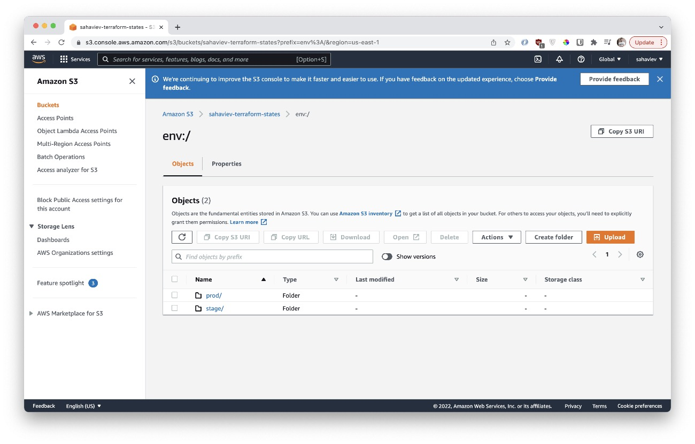

# 7.3. Основы и принцип работы Terraform

## Задача 1. Создание backend Amazon S3 (необязательно, но крайне желательно).

Если в рамках предыдущего задания у вас уже есть аккаунт AWS, то давайте продолжим знакомство со взаимодействием
terraform и aws. 

1. Создайте S3 bucket, IAM-роль и пользователя от которого будет работать terraform. Можно создать отдельного пользователя,
а можно использовать созданного в рамках предыдущего задания, просто добавьте ему необходимы права, как описано 
[здесь](https://www.terraform.io/docs/backends/types/s3.html).
1. Зарегистрируйте backend в terraform-проекте как описано по ссылке выше. 

---
**Ответ**:

Приложу скриншот AWS.S3 с папками, которые создал terraform уже после выполнения `terraform plan` для того чтобы
хранить свои состояния.




## Задача 2. Инициализируем проект и создаем workspace. 

1. Выполните `terraform init`:
    * если был создан backend в S3, то terraform создаст файлы state'ов в S3 и запись в таблице dynamodb.
    * иначе будет создан локальный файл со state.  
1. Создайте два workspace `stage` и `prod`.
1. В уже созданный `aws_instance` добавьте зависимость типа instance от workspace, что бы в разных workspace'ах использовались разные `instance_type`.
1. Добавим `count`. Для `stage` должен создаться один экземпляр `ec2`, а для `prod` два. 
1. Создайте рядом еще один `aws_instance`, но теперь определите их количество при помощи `for_each`, а не `count`.
1. Что бы при изменении типа instance не возникло ситуации, когда не будет ни одного instance добавьте параметр жизненного цикла `create_before_destroy = true` в один из ресурсов `aws_instance`.
1. При желании поэкспериментируйте с другими параметрами и ресурсами.

В виде результата работы пришлите:
* Вывод команды `terraform workspace list`.
* Вывод команды `terraform plan` для workspace `prod`.

---
**Ответ**:

### Описание структуры файлов terraform

Ссылка на папку с `tf-файлами` - [terraform/aws](terraform/aws).

1. [terraform/aws/main.tf](terraform/aws/main.tf) - файл с описанием провайдера, AMI-образа на основе которого будет 
собран instance, сети, подсети и сами инстансы **web-1** и **web-2**. 
1. [terraform/aws/outputs.tf](terraform/aws/outputs.tf) - файл с описанием вывода после выполнения **terraform**.
1. [terraform/aws/versions.tf](terraform/aws/versions.tf) - описание необходимых провайдеров **terraform**.
1. [terraform/aws/locals.tf](terraform/aws/locals.tf) - локальные переменные для того чтобы определить разную конфигурацию для **stage**/**prod**.
1. [terraform/aws/backend.tf](terraform/aws/backend.tf) - описание конфигурации с **S3**.

### Вывод команды `terraform workspace list`.

```commandline
➜  aws git:(master) ✗ terraform workspace list       
  default
* prod
  stage
```

1. **web-1** - инстансы создаются через **count**
2. **web-2** - инстансы создаются через **for_each**

### Вывод команды `terraform plan` для workspace `prod`.

Он просто гигансткий. Поэтому я его приложил в файл [terraform-plan.txt](assets/terraform-plan.txt)
