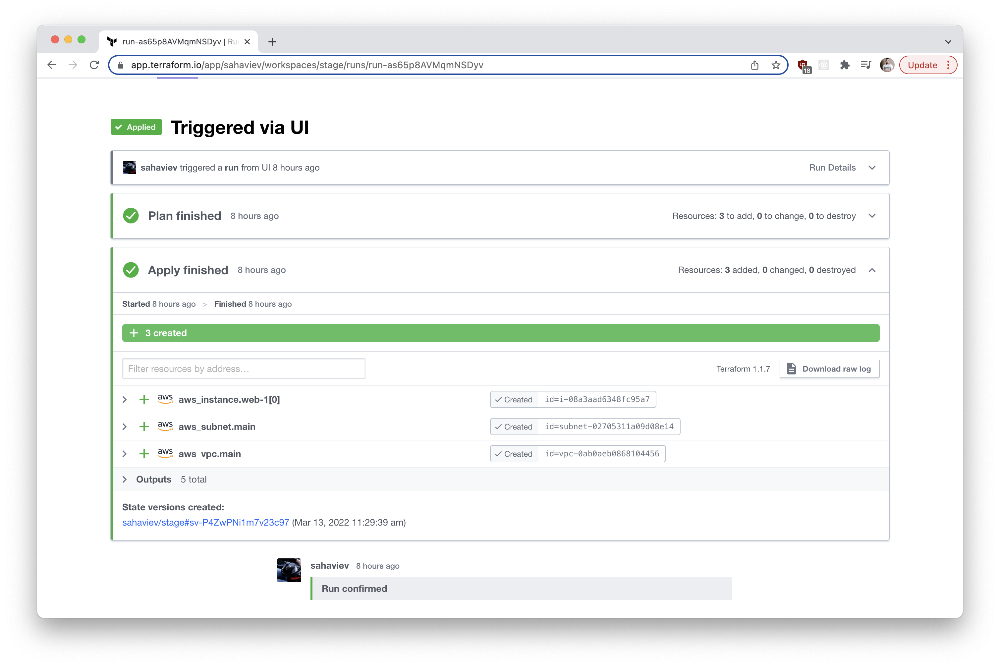
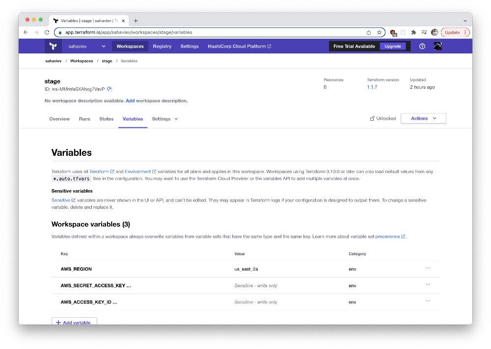
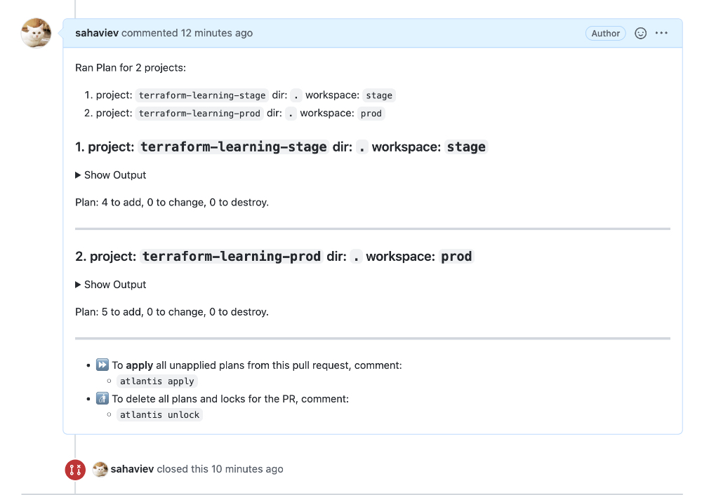

# 7.4. Средства командной работы над инфраструктурой.

## Задача 1. Настроить terraform cloud (необязательно, но крайне желательно).

В это задании предлагается познакомиться со средством командой работы над инфраструктурой предоставляемым
разработчиками terraform'а. 

1. Зарегистрируйтесь на [https://app.terraform.io/](https://app.terraform.io/).
(регистрация бесплатная и не требует использования платежных инструментов).
1. Создайте в своем github аккаунте (или другом хранилище репозиториев) отдельный репозиторий с
 конфигурационными файлами прошлых занятий (или воспользуйтесь любым простым конфигом).
1. Зарегистрируйте этот репозиторий в [https://app.terraform.io/](https://app.terraform.io/).
1. Выполните plan и apply. 

В качестве результата задания приложите снимок экрана с успешным применением конфигурации.

---
**Ответ**:

1. Terraform Cloud. Вкладка **Runs**. Создан workspace **stage**.


2. Terraform Cloud. С примером результата выполнения apply в **aws**.



3. Terraform Cloud. Пример настройки env-переменных для **aws**.



## Задача 2. Написать серверный конфиг для Atlantis'a. 

Смысл задания – познакомиться с документацией 
о [серверной](https://www.runatlantis.io/docs/server-side-repo-config.html) конфигурации и конфигурации уровня 
 [репозитория](https://www.runatlantis.io/docs/repo-level-atlantis-yaml.html).

Создай `server.yaml` который скажет атлантису:
1. Укажите, что атлантис должен работать только для репозиториев в вашем github (или любом другом) аккаунте.
1. На стороне клиентского конфига разрешите изменять `workflow`, то есть для каждого репозитория можно 
будет указать свои дополнительные команды. 
1. В `workflow` используемом по-умолчанию сделайте так, что бы во время планирования не происходил `lock` состояния.

Создай `atlantis.yaml` который, если поместить в корень terraform проекта, скажет атлантису:
1. Надо запускать планирование и аплай для двух воркспейсов `stage` и `prod`.
1. Необходимо включить автопланирование при изменении любых файлов `*.tf`.

В качестве результата приложите ссылку на файлы `server.yaml` и `atlantis.yaml`.

---
**Ответ**:

Скачиваем бинарник Atlantis'a отсюда https://github.com/runatlantis/atlantis/releases:

Команда запуск сервера Atlantis'a:

```commandline
➜  Developer ./atlantis server --config config.yaml --repo-config server.yaml
```

**config.yaml** - файл с описанием доступов к репозиторию:

```commandline
gh-user: sahaviev
gh-token: GITHUB-TOKEN-HERE
repo-allowlist: 'github.com/sahaviev/terraform-learning*'
```

P.S.: Не забываем настроить [Webhook](https://www.runatlantis.io/docs/configuring-webhooks.html) в репозитории GitHub'a
для того чтобы оны .

**server.yaml** - файл с описанием конфигурации сервера Atlantis:

```yaml
repos:
- id: github.com/sahaviev
  allowed_overrides: [workflow]
workflows:
  default:
    plan:
      steps:
      - init
      - plan:
          extra_args: ["-lock=false"]
```

**atlantis.yaml** - файл с описанием конфигурации Atlantis'a на уровне репозитория:

```yaml
version: 3
automerge: true
projects:
- name: terraform-learning-stage
  dir: .
  workspace: stage
  autoplan:
    when_modified: ["*.tf", "../modules/**/*.tf"]
    enabled: true
- name: terraform-learning-prod
  dir: .
  workspace: prod
  autoplan:
    when_modified: ["*.tf", "../modules/**/*.tf"]
    enabled: true
```

Пример репозитория с этой конфигурацией: https://github.com/sahaviev/terraform-learning

Скриншот работы Atlantis'a:



## Задача 3. Знакомство с каталогом модулей.

1. В [каталоге модулей](https://registry.terraform.io/browse/modules) найдите официальный модуль от aws для создания
`ec2` инстансов. 
2. Изучите как устроен модуль. Задумайтесь, будете ли в своем проекте использовать этот модуль или непосредственно 
ресурс `aws_instance` без помощи модуля?
3. В рамках предпоследнего задания был создан ec2 при помощи ресурса `aws_instance`. 
Создайте аналогичный инстанс при помощи найденного модуля.   

В качестве результата задания приложите ссылку на созданный блок конфигураций. 

---
**Ответ**:

1. Ссылка на официальный ec2-модуль от amazon: https://registry.terraform.io/modules/terraform-aws-modules/ec2-instance
2. На мой взгляд в модуле очень много лишнего и не факт что я буду использовать именно его, а не ресурс `aws_instance`.
3. Мой пример использования модуля **ec2_instance**: https://github.com/sahaviev/terraform-example/blob/main/aws/main.tf

P.S.: код задания из предыдущей лекции [7.3-TERRAFORM/terraform/aws/main.tf](https://github.com/sahaviev/netology-devops/blob/master/2-virt-homeworks/7.3-TERRAFORM/terraform/aws/main.tf)

