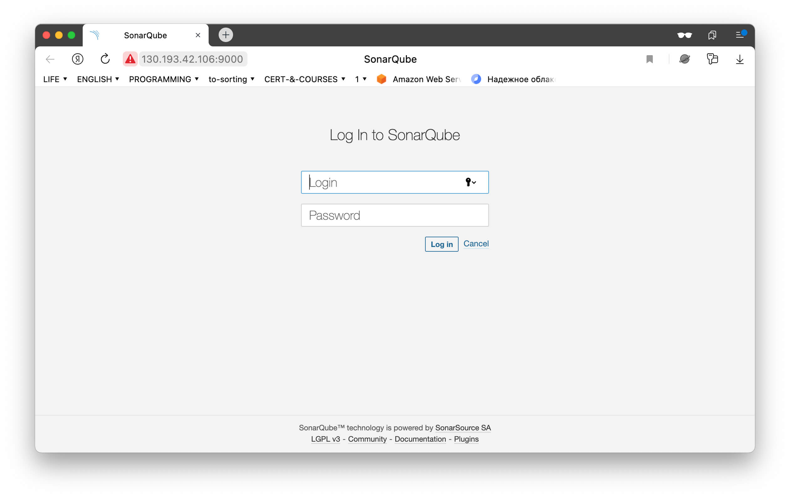
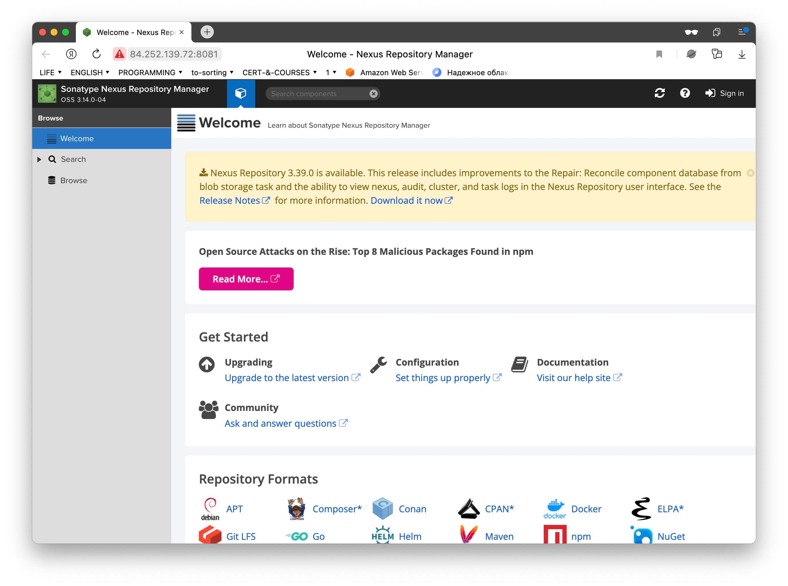
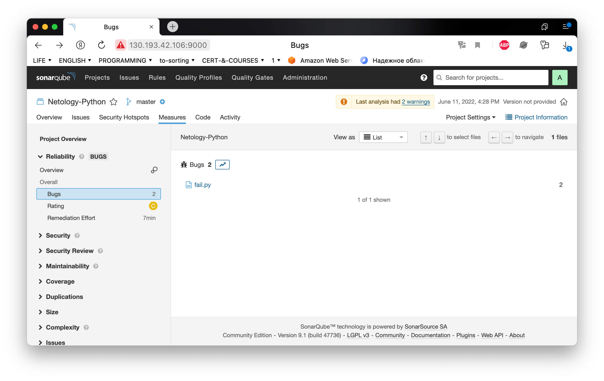
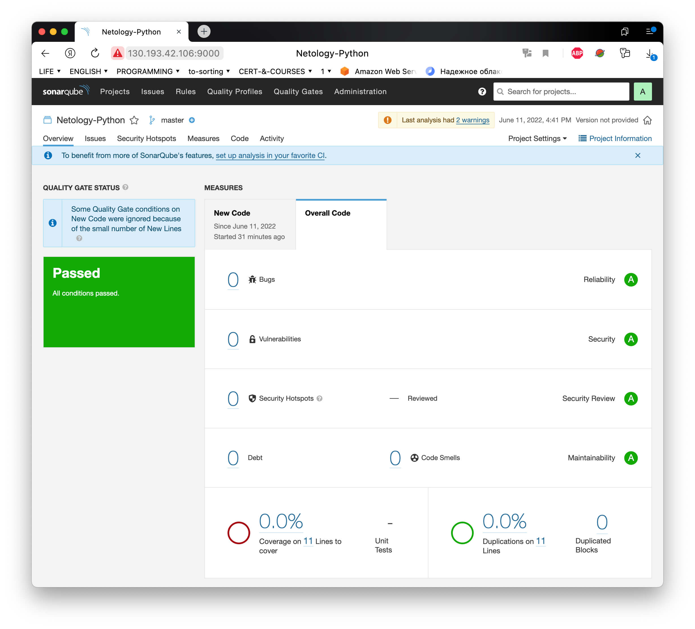
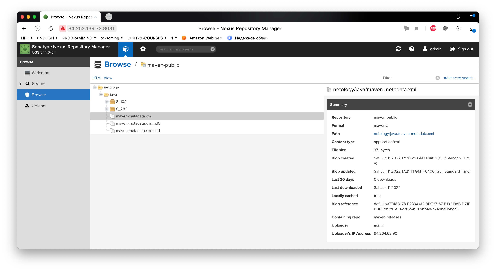

# Домашнее задание к занятию "09.03 CI\CD"

## Подготовка к выполнению

1. Создаём 2 VM в yandex cloud со следующими параметрами: 2CPU 4RAM Centos7(остальное по минимальным требованиям)
2. Прописываем в [inventory](./infrastructure/inventory/cicd/hosts.yml) [playbook'a](./infrastructure/site.yml) созданные хосты
3. Добавляем в [files](./infrastructure/files/) файл со своим публичным ключом (id_rsa.pub). Если ключ называется иначе - найдите таску в плейбуке, которая использует id_rsa.pub имя и исправьте на своё
4. Запускаем playbook, ожидаем успешного завершения
5. Проверяем готовность Sonarqube через [браузер](http://localhost:9000)
6. Заходим под admin\admin, меняем пароль на свой
7.  Проверяем готовность Nexus через [бразуер](http://localhost:8081)
8. Подключаемся под admin\admin123, меняем пароль, сохраняем анонимный доступ

---
**Ответ**:

https://github.com/sahaviev/ansible-learning/tree/main/ansible-homework-5 - ansible **playbook**

Проверка работоспособности SonarQube



Проверка работоспособности Nexus




## Знакомство с SonarQube

### Основная часть

1. Создаём новый проект, название произвольное
2. Скачиваем пакет sonar-scanner, который нам предлагает скачать сам sonarqube
3. Делаем так, чтобы binary был доступен через вызов в shell (или меняем переменную PATH или любой другой удобный вам способ)
4. Проверяем `sonar-scanner --version`
5. Запускаем анализатор против кода из директории [example](./example) с дополнительным ключом `-Dsonar.coverage.exclusions=fail.py`
6. Смотрим результат в интерфейсе
7. Исправляем ошибки, которые он выявил(включая warnings)
8. Запускаем анализатор повторно - проверяем, что QG пройдены успешно
9. Делаем скриншот успешного прохождения анализа, прикладываем к решению ДЗ

---
**Ответ**:

Установка sonar-scanner

```commandline
brew install sonar-scanner
```

Версия sonar-scanner(проверка работоспособности)

```commandline
➜  9.3-CICD git:(master) ✗ sonar-scanner --version   
INFO: Scanner configuration file: /opt/homebrew/Cellar/sonar-scanner/4.7.0.2747/libexec/conf/sonar-scanner.properties
INFO: Project root configuration file: NONE
INFO: SonarScanner 4.7.0.2747
INFO: Java 11.0.15 Homebrew (64-bit)
INFO: Mac OS X 12.1 aarch64
```

Команда для запуска sonar-scanner в текущей директории:

```commandline
sonar-scanner \
  -Dsonar.projectKey=Netology-Python \
  -Dsonar.sources=. \
  -Dsonar.host.url=http://130.193.42.106:9000 \
  -Dsonar.login=60cb61fe0e6dabebd464e377a7a500defe1a7c58
```

Процесс проверки запуска:

```commandline
INFO: Scanner configuration file: /opt/homebrew/Cellar/sonar-scanner/4.7.0.2747/libexec/conf/sonar-scanner.properties
INFO: Project root configuration file: NONE
INFO: SonarScanner 4.7.0.2747
INFO: Java 11.0.15 Homebrew (64-bit)
INFO: Mac OS X 12.1 aarch64
...
... Too much output
...
INFO: ANALYSIS SUCCESSFUL, you can browse http://130.193.42.106:9000/dashboard?id=Netology-Python
INFO: Note that you will be able to access the updated dashboard once the server has processed the submitted analysis report
INFO: More about the report processing at http://130.193.42.106:9000/api/ce/task?id=AYFSvJewpAn-UO0wmKzP
INFO: Analysis total time: 8.872 s
INFO: ------------------------------------------------------------------------
INFO: EXECUTION SUCCESS
INFO: ------------------------------------------------------------------------
INFO: Total time: 1:35.085s
INFO: Final Memory: 8M/34M
INFO: ------------------------------------------------------------------------
```

Пример сканирования SonarQube с ошибкой:



Пример сканирования SonarQube без ошибок:



## Знакомство с Nexus

### Основная часть

1. В репозиторий `maven-public` загружаем артефакт с GAV параметрами:
   1. groupId: netology
   2. artifactId: java
   3. version: 8_282
   4. classifier: distrib
   5. type: tar.gz
2. В него же загружаем такой же артефакт, но с version: 8_102
3. Проверяем, что все файлы загрузились успешно
4. В ответе присылаем файл `maven-metadata.xml` для этого артефекта

---
**Ответ**:

Файл [maven-metadata.xml](assets/maven-metadata.xml)

```xml
<?xml version="1.0" encoding="UTF-8"?>
<metadata modelVersion="1.1.0">
  <groupId>netology</groupId>
  <artifactId>java</artifactId>
  <versioning>
    <latest>8_282</latest>
    <release>8_282</release>
    <versions>
      <version>8_102</version>
      <version>8_282</version>
    </versions>
    <lastUpdated>20220611132114</lastUpdated>
  </versioning>
</metadata>
```

Файл [maven-metadata.xml](assets/maven-metadata.xml) в интерфейсе Nexus:




### Знакомство с Maven

### Подготовка к выполнению

1. Скачиваем дистрибутив с [maven](https://maven.apache.org/download.cgi)
2. Разархивируем, делаем так, чтобы binary был доступен через вызов в shell (или меняем переменную PATH или любой другой удобный вам способ)
3. Удаляем из `apache-maven-<version>/conf/settings.xml` упоминание о правиле, отвергающем http соединение( раздел mirrors->id: my-repository-http-unblocker)
4. Проверяем `mvn --version`
5. Забираем директорию [mvn](./mvn) с pom

---
**Ответ**:

Maven скачан и установлен из источника указанный ваше.

Для того чтобы все заработало папка bin прописана в PATH временно с помощью команды export:

```commandline
➜  apache-maven-3.8.5 export PATH=$PATH:$(pwd)
```

Версия Maven(проверка работоспособности)

```commandline
➜  apache-maven-3.8.5 mvn --version
Apache Maven 3.8.5 (3599d3414f046de2324203b78ddcf9b5e4388aa0)
Maven home: /Users/railsakhaviev/Desktop/apache-maven-3.8.5
Java version: 18.0.1.1, vendor: Oracle Corporation, runtime: /Library/Java/JavaVirtualMachines/jdk-18.0.1.1.jdk/Contents/Home
Default locale: en_AE, platform encoding: UTF-8
OS name: "mac os x", version: "12.1", arch: "aarch64", family: "mac"
```


### Основная часть

1. Меняем в `pom.xml` блок с зависимостями под наш артефакт из первого пункта задания для Nexus (java с версией 8_282)
2. Запускаем команду `mvn package` в директории с `pom.xml`, ожидаем успешного окончания
3. Проверяем директорию `~/.m2/repository/`, находим наш артефакт
4. В ответе присылаем исправленный файл `pom.xml`

---
**Ответ**:

Исправленный [pom.xml](mvn/pom.xml)

```xml
<project xmlns="http://maven.apache.org/POM/4.0.0" xmlns:xsi="http://www.w3.org/2001/XMLSchema-instance"
  xsi:schemaLocation="http://maven.apache.org/POM/4.0.0 http://maven.apache.org/xsd/maven-4.0.0.xsd">
  <modelVersion>4.0.0</modelVersion>

  <groupId>com.netology.app</groupId>
  <artifactId>simple-app</artifactId>
  <version>1.0-SNAPSHOT</version>
   <repositories>
    <repository>
      <id>my-repo</id>
      <name>maven-public</name>
      <url>http://84.252.139.72:8081/repository/maven-public/</url>
    </repository>
  </repositories>
  <dependencies>
    <dependency>
      <groupId>netology</groupId>
      <artifactId>java</artifactId>
      <version>8_282</version>
      <classifier>distrib</classifier>
      <type>tar.gz</type>
    </dependency>
  </dependencies>
</project>
```
