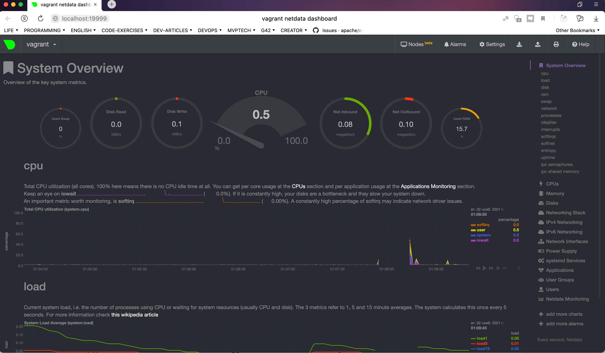

# 3.4. Операционные системы, лекция 2

### 1. На лекции мы познакомились с node_exporter. 
В демонстрации его исполняемый файл запускался в background. Этого достаточно для демо,
но не для настоящей production-системы, где процессы должны находиться под внешним 
управлением. Используя знания из лекции по systemd, создайте самостоятельно простой
unit-файл для node_exporter:

* поместите его в автозагрузку,
* предусмотрите возможность добавления опций к запускаемому процессу через внешний файл (посмотрите, например, на systemctl cat cron),
* удостоверьтесь, что с помощью systemctl процесс корректно стартует, завершается, а после перезагрузки автоматически поднимается.

Установка **node_exporter**:

```commandline
vagrant@vagrant:~$ wget https://github.com/prometheus/node_exporter/releases/download/v1.2.2/node_exporter-1.2.2.linux-amd64.tar.gz
vagrant@vagrant:~$ tar zxvf node_exporter-*.linux-amd64.tar.gz
vagrant@vagrant:~$ cd node_exporter-*.linux-amd64
vagrant@vagrant:~/node_exporter-1.2.2.linux-amd64$ sudo su
root@vagrant:/home/vagrant/node_exporter-1.2.2.linux-amd64# cp node_exporter /usr/local/bin/
```

Создание пользователя **nodeusr**:
```commandline
root@vagrant:/home/vagrant/node_exporter-1.2.2.linux-amd64# useradd --no-create-home --shell /bin/false nodeusr
root@vagrant:/home/vagrant/node_exporter-1.2.2.linux-amd64# chown -R nodeusr:nodeusr /usr/local/bin/node_exporter
```

Создание сервиса(**systemd.service**):
```commandline
root@vagrant:/home/vagrant/node_exporter-1.2.2.linux-amd64
root@vagrant:vi /etc/systemd/system/node_exporter.service
```

```commandline
[Unit]
Description=Node Exporter Service
After=network.target

[Service]
User=nodeusr
Group=nodeusr
Type=simple
ExecStart=/bin/bash -c "/usr/local/bin/node_exporter $(cat /home/vagrant/node_exporter.conf)"
ExecReload=/bin/kill -HUP $MAINPID
Restart=on-failure

[Install]
WantedBy=multi-user.target
```

Содержимое файла `/home/vagrant/node_exporter.conf`(конечно же путь на боевом решении будет лежать где-то в другом месте,
этот только для демки), с параметрами запуска node_exporter(конфигурацией запускаемых коллекторов):
```commandline
--collector.cpu --collector.meminfo --collector.loadavg --collector.time
```

## P.S. про передачу параметров.
Мне кажется я набыдлокодил и все это возможно можно было бы сделать более изящно через EnvironmentFile,
но у меня почему-то не получалось передать 1 string env variable c разными коллекторами. 
Как я только не пытался. Подскажите, пожалуйста, как правильно через EnvironmentFile передать массив? 

Настройка для авто-запуска:

```commandline
root@vagrant:/home/vagrant# systemctl daemon-reload
root@vagrant:/home/vagrant# systemctl enable node_exporter
root@vagrant:/home/vagrant# systemctl start node_exporter
```

Статус работы сервиса node_exporter:

```commandline
root@vagrant:/home/vagrant# systemctl status node_exporter
● node_exporter.service - Node Exporter Service
     Loaded: loaded (/etc/systemd/system/node_exporter.service; enabled; vendor preset: enabled)
    Drop-In: /etc/systemd/system/node_exporter.service.d
             └─override.conf
     Active: active (running) since Fri 2021-11-05 08:19:40 UTC; 2min 15s ago
   Main PID: 3238 (node_exporter)
      Tasks: 5 (limit: 1070)
     Memory: 2.4M
     CGroup: /system.slice/node_exporter.service
             └─3238 /usr/local/bin/node_exporter --collector.cpu --collector.meminfo --collector.loadavg
....
```

Проверка работы node_exporter:

```commandline
root@vagrant:/home/vagrant# curl http://localhost:9100/metrics > node_exporter.txt
  % Total    % Received % Xferd  Average Speed   Time    Time     Time  Current
                                 Dload  Upload   Total   Spent    Left  Speed
100 59789    0 59789    0     0  9731k      0 --:--:-- --:--:-- --:--:-- 9731k
root@vagrant:/home/vagrant# head node_exporter.txt
# HELP go_gc_duration_seconds A summary of the pause duration of garbage collection cycles.
# TYPE go_gc_duration_seconds summary
go_gc_duration_seconds{quantile="0"} 0.00013861
go_gc_duration_seconds{quantile="0.25"} 0.00013861
go_gc_duration_seconds{quantile="0.5"} 0.00013861
go_gc_duration_seconds{quantile="0.75"} 0.00013861
```


### 2. Ознакомьтесь с опциями node_exporter и выводом /metrics по-умолчанию. 
Приведите несколько опций, которые вы бы выбрали для базового мониторинга хоста по CPU, памяти, диску и сети.

Для базового мониторинга хоста я бы взял следующие коллекторы: **cpu**, **meminfo**, **loadavg**, **filesystem**, **mdadm**, **netstat** и **time**

### 3. Установите в свою виртуальную машину Netdata.
Воспользуйтесь готовыми пакетами для установки (sudo apt install -y netdata). После успешной установки:

* в конфигурационном файле /etc/netdata/netdata.conf в секции [web] замените значение с localhost на bind to = 0.0.0.0,
* добавьте в Vagrantfile проброс порта Netdata на свой локальный компьютер и сделайте vagrant reload:

```commandline
config.vm.network "forwarded_port", guest: 19999, host: 19999
```

После успешной перезагрузки в браузере на своем ПК (не в виртуальной машине) вы должны суметь зайти на localhost:19999. Ознакомьтесь с метриками, которые по умолчанию собираются Netdata и с комментариями, которые даны к этим метрикам.




### 4. Можно ли по выводу `dmesg` понять, осознает ли ОС, что загружена не на настоящем оборудовании, а на системе виртуализации?

Да, внизу я приложил и вырезал большую часть вывода от **dmesg**.
Там в выводе сверху почти сразу идет сообщение о том что обнаружен Hypervisor KVM:

```commandline
vagrant@vagrant:~$ dmesg
[    0.000000] Linux version 5.4.0-80-generic (buildd@lcy01-amd64-030) (gcc version 9.3.0 (Ubuntu 9.3.0-17ubuntu1~20.04)) #90-Ubuntu SMP Fri Jul 9 22:49:44 UTC 2021 (Ubuntu 5.4.0-80.90-generic 5.4.124)
...
[    0.000000] DMI: innotek GmbH VirtualBox/VirtualBox, BIOS VirtualBox 12/01/2006
[    0.000000] Hypervisor detected: KVM
[    0.000000] kvm-clock: Using msrs 4b564d01 and 4b564d00
...
```


### 5. Как настроен sysctl `fs.nr_open` на системе по-умолчанию? 
Узнайте, что означает этот параметр. Какой другой существующий лимит не позволит 
достичь такого числа (`ulimit --help`)?

Этот параметр ограничивает количество одновременно открытых в системе файлов.

По умолчанию - 1048576.

```commandline
root@vagrant:/home/vagrant# sysctl fs.nr_open
fs.nr_open = 1048576
```

Есть еще команда `ulimit -n`, которая ограничивает количество одновременно открытых файловых дескрипторов.


```commandline
root@vagrant:/home/vagrant# ulimit --help
...
-n	the maximum number of open file descriptors
...
root@vagrant:/home/vagrant# ulimit -n
2048
```

Увеличивается так:

```commandline
root@vagrant:/home/vagrant# ulimit -n 5000
root@vagrant:/home/vagrant# ulimit -n
5000
```


### 6. Запустите любой долгоживущий процесс (не `ls`, который отработает мгновенно, а, например, `sleep 1h`) в отдельном неймспейсе процессов;
Покажите, что ваш процесс работает под PID 1 через `nsenter`.
Для простоты работайте в данном задании под root (`sudo -i`). 
Под обычным пользователем требуются дополнительные опции (`--map-root-user`) и т.д.

```commandline
root@vagrant:/home/vagrant# screen 
oot@vagrant:/home/vagrant# unshare -f --pid --mount-proc /usr/bin/sleep 1h
^Z
[1]+  Stopped                 unshare -f --pid --mount-proc /usr/bin/sleep 1h
root@vagrant:/home/vagrant# ps aux
...
...
...
root       37890  0.0  0.0   8308   592 pts/4    T    22:17   0:00 unshare -f --pid --mo
root       37891  0.0  0.0   8304   592 pts/4    S    22:17   0:00 /usr/bin/sleep 1h
root       37892  0.0  0.3  11692  3480 pts/4    R+   22:17   0:00 ps aux
root@vagrant:/home/vagrant#
root@vagrant:/home/vagrant# nsenter --target 37891 --pid --mount
root@vagrant:/# ps aux
USER         PID %CPU %MEM    VSZ   RSS TTY      STAT START   TIME COMMAND
root           1  0.0  0.0   8304   592 pts/4    S    22:17   0:00 /usr/bin/sleep 1h
root           2  0.0  0.4  10168  4096 pts/4    S    22:18   0:00 -bash
root          11  0.0  0.3  11692  3548 pts/4    R+   22:18   0:00 ps aux
```


### 7. Найдите информацию о том, что такое :(){ :|:& };:. 
Запустите эту команду в своей виртуальной машине Vagrant с Ubuntu 20.04 (это важно, поведение в других ОС не проверялось). 
Некоторое время все будет "плохо", после чего (минуты) – ОС должна стабилизироваться. 
Вызов dmesg расскажет, какой механизм помог автоматической стабилизации. 
Как настроен этот механизм по-умолчанию, и как изменить число процессов, 
которое можно создать в сессии?

Как я понял это есть вывод **dmesg** который рассказывает о механизме автоматической стабилизации:

```commandline
cgroup: fork rejected by pids controller in /user.slice/user-1000.slice/session-34.scope
```

**pids controller** запретил создавать fork's.

Изменить количество процессов которые можно создавать в сессии можно через файл:

```commandline
vi /etc/security/limits.conf
```

Отредактировать его root'ом и указать лимит процессов для форка пользователю в формате:

```commandline
your_user_name hard nproc 10
```

### Материалы которые мне помогали

1. [Мониторинг с Prometeus](https://medium.com/@p.zhel.81/monitor-all-your-nodes-by-prometeus-efe113388e25)
2. [Список коллекторов node_exporter](https://github.com/prometheus/node_exporter/blob/master/README.md#enabled-by-default)
3. [Fork-бомба ](https://ru.wikipedia.org/wiki/Fork-бомба)
4. [Fork() Bomb](https://www.geeksforgeeks.org/fork-bomb/)


