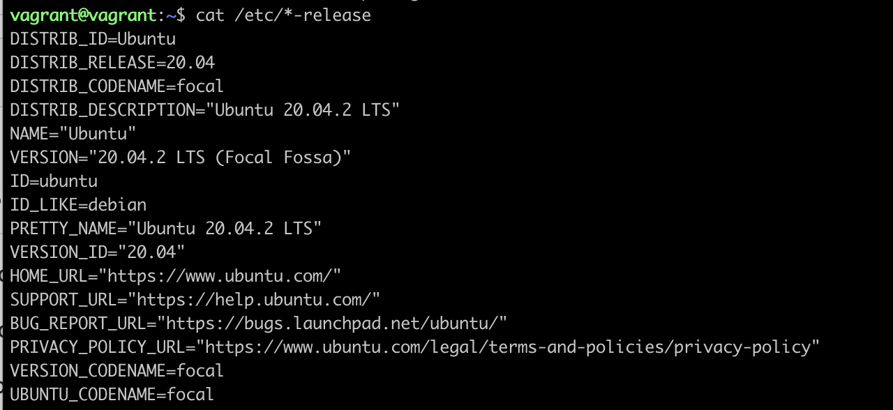
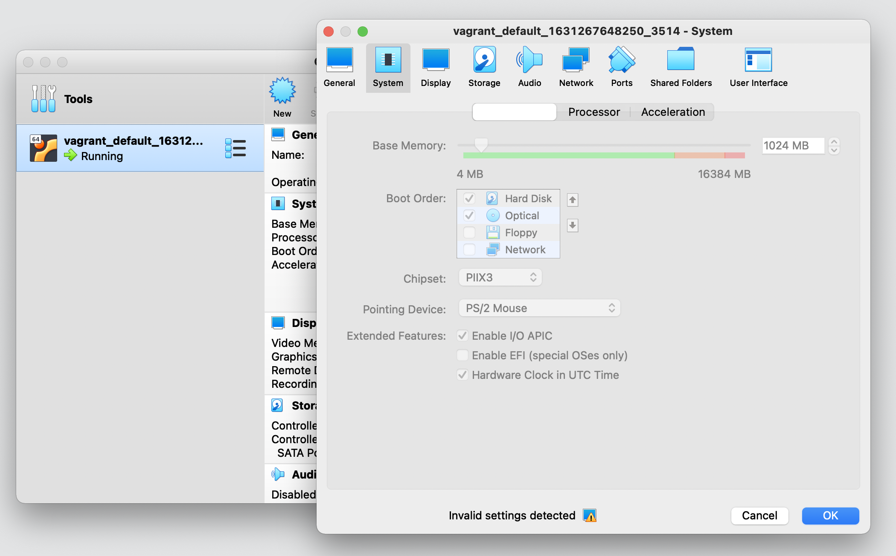

# 3.1. Работа в терминале, лекция 1

1. **Vagrant** и **VirtualBox** установлены.
2. Запущен образ **Ubuntu 20.04.2 LTS**



### Ознакомьтесь с графическим интерфейсом VirtualBox, посмотрите как выглядит виртуальная машина, которую создал для вас Vagrant, какие аппаратные ресурсы ей выделены. Какие ресурсы выделены по-умолчанию?

* 2 CPU cores - 100% allocate 
* 1024 Mb RAM
* 64 Gb HDD
* 4 Mb Video Memory

### Ознакомьтесь с возможностями конфигурации VirtualBox через Vagrantfile: документация. Как добавить оперативной памяти или ресурсов процессора виртуальной машине?

1. Сначала отключаем виртуальную машину, потом можно увеличить память и количество CPU.



2. Через Vagrantfile с таким содержимым

```console
Vagrant.configure("2") do |config|
        config.vm.box = "bento/ubuntu-20.04"
        config.vm.provider "virtualbox" do |v|
                v.memory = 2024
                v.cpus = 4
        end
end
```


### Какой переменной можно задать длину журнала history, и на какой строчке manual это описывается?

Переменная **HISTSIZE**, строка 977

```
    HISTSIZE
      The number of commands to remember in the command history (see HISTORY  below).   If
      the  value  is  0,  commands are not saved in the history list.  Numeric values less
      than zero result in every command being saved on  the  history  list  (there  is  no
      limit).  The shell sets the default value to 500 after reading any startup files.
```

### Что делает директива ignoreboth в bash?

Переменная **HISTCONTROL** контролирует каким образом список команд сохраняется в истории.

1. Директива **ignorespace** — не сохранять строки начинающиеся с символа <пробел>
2. Директива **ignoredups** — не сохранять строки, совпадающие с последней выполненной командой
3. Директива **ignoreboth** - синоним для **ignorespace** и **ignoredups**

```
    HISTCONTROL
        A colon-separated list of values controlling how commands are saved on  the  history
        list.   If  the  list of values includes ignorespace, lines which begin with a space
        character are not saved in the history list.  A value  of  ignoredups  causes  lines
        matching  the  previous  history  entry  to  not be saved.  A value of ignoreboth is
        shorthand for ignorespace and ignoredups.  A value of erasedups causes all  previous
        lines matching the current line to be removed from the history list before that line
        is saved.  Any value not in the above list is ignored.  If HISTCONTROL is unset,  or
        does  not include a valid value, all lines read by the shell parser are saved on the
        history list, subject to the value of HISTIGNORE.  The second and  subsequent  lines
        of  a  multi-line  compound command are not tested, and are added to the history re‐
        gardless of the value of HISTCONTROL.
```

### В каких сценариях использования применимы скобки `{}` и на какой строчке `man bash` это описано?

Конструкция **Compound Commands**, строка 204

Конструкция **Brace Expansion**, строка 833

### Как создать однократным вызовом touch 100000 файлов?

`touch {1..10000}.txt`

### Получится ли аналогичным образом создать 300000? Если нет, то почему?

Не сработает из-за ограничения bash на количество аргументов.
Скорее даже на **длину команды**, потому что если 
создавать с названием файла более длинным, например, `touch file{1..10000}.txt`,
то и 100к не пройдет.

> -bash: /usr/bin/touch: Argument list too long

Можно создать изменив максимальный размер стэка

`ulimit -s 65536`


### В man bash поищите по /\[\[. Что делает конструкция [[ -d /tmp ]]

Раздел **CONDITIONAL EXPRESSIONS**, строка 1403

В условном выражении сообщает что данный файл существует и является каталогом. 
Возвращает код ответа 1, в противном случае 0. 

Я с bash скриптами не очень хорошо знаком, к сожалению. 
И некоторые вопросы прям пришлось искать и разбираться как сделать. 
Лучше всего данную конструкцию иллюстрирует следующий bash-скрипт
(я его сам написал):

```console
#!/bin/bash
if [ -d /tmp ]
then
    echo -e "Folder $folder exists"
else
    echo -e "Folder $folder doesnt exists"
fi
```

### Добейтесь в выводе type -a bash в виртуальной машине наличия первым пунктом в списке

```console
# mkdir /tmp/new_path_directory
# cp /bin/bash /tmp/new_path_directory
# export PATH="/tmp/new_path_directory/:$PATH"
# type -a bash
bash is /tmp/new_path_directory/bash
bash is /usr/bin/bash
bash is /bin/bash
```


### Чем отличается планирование команд с помощью batch и at?

Эти команды планировщики задач.

Команда at используется для назначения одноразового задания на заданное время.

Команда batch — для назначения одноразовых задач, которые должны выполняться, когда загрузка системы становится меньше 0,8.

Честно говоря, для меня немного странно назначение команды **batch**...